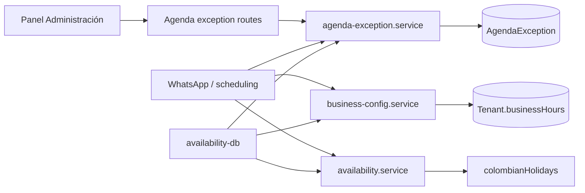

# Excepciones de Agenda — Etapa 3: Arquitectura técnica

**Estado:** propuesta para aprobación de Etapa 4  
**Precondiciones:** Etapas 1 y 2 aprobadas el 2026-09-17.

## Decisión arquitectónica

Las excepciones pertenecen al contexto Agenda y se persisten como registros
propios, tenant-scoped. No se agregan al JSON `Tenant.businessHours`: las
excepciones son datos fechados, auditables y consultables por rango; el horario
semanal sigue siendo configuración estable del establecimiento.

El motor conservará una única resolución efectiva de disponibilidad. La
excepción se consulta una vez por fecha y tipo de agenda, y se entrega al
resolver puro existente; validar una reserva, sugerir veterinaria y buscar el
siguiente turno de peluquería compartirán ese resultado.

## Componentes

### `agenda-exception.service.js`

Responsable de acceso y reglas de las excepciones:

- validar el comando de creación o actualización;
- detectar solapamientos dentro de un tenant y alcance;
- crear, listar, actualizar y eliminar;
- resolver la excepción aplicable a una fecha y tipo de agenda;
- consultar citas activas afectadas para el resumen administrativo.

Es el único módulo que consulta `prisma.agendaException`. Las rutas no hacen
consultas directas y el motor de disponibilidad no conoce Prisma ni SQL.

### `availability.service.js`

Se conserva como capa pura de calendario colombiano y horario semanal. Recibe
la excepción ya resuelta por cada consumidor; no consulta la base de datos. Su
responsabilidad es aplicar la precedencia definida:

1. excepción específica o global ya resuelta;
2. festivo colombiano;
3. horario por servicio del ADR 012;
4. horario general;
5. comportamiento legado.

### Consumidores existentes

- `scheduling.service.js`: obtiene el horario y la excepción aplicable, y usa
  las funciones puras para validar el horario propuesto por el cliente.
- `availability-db.service.js`: obtiene el horario una vez y la excepción de
  cada día explorado para disponibilidad, sugerencias y regla consecutiva de
  peluquería.
- `appointment.service.js` y la confirmación final continúan usando el mismo
  chequeo de conflicto ya vigente; no reciben una segunda regla paralela.

## Rutas administrativas

Archivo nuevo: `backend/src/routes/dashboard/agenda-exceptions.routes.js`,
montado desde `dashboard.routes.js` bajo el middleware ya existente
`resolveTenant`.

| Método y ruta | Caso de uso |
| --- | --- |
| `GET /agenda-exceptions?from=&to=` | UC-01, listar por rango. |
| `POST /agenda-exceptions` | UC-02, crear y devolver resumen de afectadas. |
| `PATCH /agenda-exceptions/:id` | UC-03, modificar y devolver resumen. |
| `DELETE /agenda-exceptions/:id` | UC-04, eliminar. |

El `tenantId` proviene solo de `req.tenant`; nunca del cuerpo, parámetros ni
consulta. La respuesta de afectadas no expondrá datos de otros tenants.

## Interfaz administrativa

`ScheduleSection` incorporará una sección “Fechas especiales y festivos” con:

- listado del período visible;
- formulario de cierre, apertura u horario reducido;
- selector de alcance `todo el negocio`, `veterinaria` o `peluquería`;
- motivo opcional;
- vista previa del número y detalle de las citas afectadas antes de guardar;
- confirmación explícita de que ninguna cita se cancelará automáticamente.

La agenda semanal no se reemplaza: la sección de excepciones complementa los
tres horarios ya configurables.

## Manejo de errores

Las rutas traducen solo los errores de dominio definidos en Etapa 2 a `400`,
`404` o `409` (`AgendaExceptionOverlap`). Los errores inesperados se registran
sin exponer detalles internos y responden `500`.

Ante una falla al leer excepciones durante una reserva, el sistema debe fallar
cerrado para esa fecha y registrar el error: ofrecer una cita durante un cierre
configurado es peor que pedir al cliente reintentar. Esto no modifica la
semántica de fallos de `Tenant.businessHours`; se limita a la nueva regla de
excepciones.

## Pruebas requeridas

- Unidad: precedencia específica/global/festivo/horario semanal.
- Unidad: validación de fechas, horarios y solapamientos.
- Integración: aislamiento entre tenants y resumen de citas afectadas.
- Regresión: sin excepciones, el comportamiento actual de los 1009 tests se
  mantiene.
- Interfaz: compilación, lint y prueba manual de crear, editar y borrar una
  excepción.

## Decisiones arquitectónicas diferidas

- Notificar o reprogramar automáticamente a clientes afectados.
- Calendario por `Service` individual, no por las agendas compartidas actuales.
- Excepciones de staff integradas con la disponibilidad global.
- País y zona horaria configurables por tenant.

## Resultado de la etapa

La solución queda aislada en Agenda, con una sola lectura efectiva de
disponibilidad y sin duplicar lógica entre dashboard, WhatsApp y sugerencias.
La siguiente etapa define entidades, relaciones e invariantes de persistencia.
