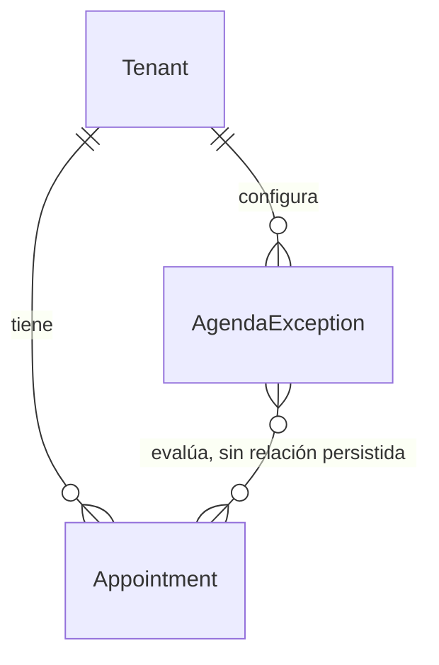

# Excepciones de Agenda — Etapa 4: Modelo de persistencia

**Estado:** propuesta para aprobación de Etapa 5  
**Precondiciones:** Etapas 1, 2 y 3 aprobadas el 2026-09-17.

## Entidad nueva: `AgendaException`

Una excepción es una regla operativa fechada del establecimiento. No es una
cita, una ausencia de staff ni un cambio del horario semanal. Su ciclo de vida
es independiente de las citas que pueda afectar.

| Campo | Tipo conceptual | Obligatorio | Descripción |
| --- | --- | --- | --- |
| `id` | identificador | Sí | Identificador inmutable de la excepción. |
| `tenantId` | identificador de Tenant | Sí | Propietario y frontera de aislamiento. |
| `scope` | enum textual | Sí | `all`, `vet` o `grooming`. |
| `mode` | enum textual | Sí | `closed` u `open`. |
| `startDate` | fecha de negocio | Sí | Primer día Bogotá afectado, `YYYY-MM-DD`. |
| `endDate` | fecha de negocio | No | Último día Bogotá afectado, inclusivo. |
| `open` | hora local | Condicional | Obligatoria solo para `mode=open`, `HH:mm`. |
| `close` | hora local | Condicional | Obligatoria solo para `mode=open`, `HH:mm`. |
| `reason` | texto corto | No | Motivo administrativo, por ejemplo “Inventario anual”. |
| `createdAt` | instante | Sí | Auditoría de creación. |
| `updatedAt` | instante | Sí | Auditoría de última modificación. |

Las fechas se guardan como claves de calendario y no como `DateTime`: una
excepción de “Navidad” representa el día civil de Bogotá, no un instante UTC.
Esto evita desplazar una fecha al convertir entre zonas horarias.

## Relaciones y agregado

- `AgendaException` pertenece obligatoriamente a un solo `Tenant`.
- `Tenant` expone la colección `agendaExceptions`.
- `Appointment` no tendrá `agendaExceptionId`: una misma excepción puede
  afectar muchas citas y una cita puede ser afectada por distintas excepciones
  a lo largo de cambios administrativos. La relación es calculada, no una
  propiedad histórica de la cita.
- No se modifica el esquema ni el ciclo de vida de `StaffAvailability`.

## Invariantes de persistencia

1. `tenantId` no puede ser nulo.
2. `scope ∈ { all, vet, grooming }`.
3. `mode ∈ { closed, open }`.
4. `startDate` y `endDate`, cuando exista, deben tener formato ISO de fecha;
   `endDate >= startDate`.
5. Para `closed`, `open` y `close` son nulos.
6. Para `open`, ambas horas existen, tienen formato `HH:mm` y `open < close`.
7. Dos registros del mismo tenant y alcance no pueden cubrir el mismo día.
8. Registros de tenants distintos pueden tener las mismas fechas sin relación
   entre sí.
9. Un registro global y uno específico pueden coexistir para un mismo período;
   la prioridad se resuelve en lectura y no se codifica como relación física.

## Consulta de citas afectadas

La consulta es derivada y no se persiste:

1. Limita por `Appointment.tenantId`.
2. Limita por el intervalo de la excepción, usando los límites horarios Bogotá
   existentes.
3. Ignora estados `cancelled` y `no_show`.
4. Si el alcance es específico, filtra por el bucket efectivo de agenda
   (`vet` o `grooming`), reutilizando la normalización que ya protege la
   disponibilidad.
5. Con `closed`, todas las citas activas del alcance quedan afectadas.
6. Con `open`, solo quedan afectadas las que estén fuera de la nueva ventana.

El resultado se calcula para mostrarlo en la operación administrativa; no
actualiza citas, mensajes, recordatorios ni eventos.

## Eliminación y retención

La eliminación es física en esta primera versión porque la excepción no es un
registro financiero ni una decisión irreversible. Las fechas, mensajes y citas
no se eliminan en cascada. Si más adelante se requiere una bitácora de cambios
administrativos, será una capacidad de auditoría separada.

## Compatibilidad

- Los tenants sin `AgendaException` conservan exactamente el comportamiento de
  horarios por servicio del ADR 012 y de los festivos nacionales.
- Las citas existentes no requieren migración ni una columna nueva.
- El catálogo de servicios no cambia: `scope` representa las dos agendas
  compartidas que ya conoce el motor.

## Resultado de la etapa

El modelo persiste las excepciones como reglas tenant-scoped, fechadas y sin
ambigüedad de tiempo. La siguiente etapa definirá el modelo Prisma, índices,
restricciones PostgreSQL y la migración requerida para hacer cumplir estos
invariantes.
