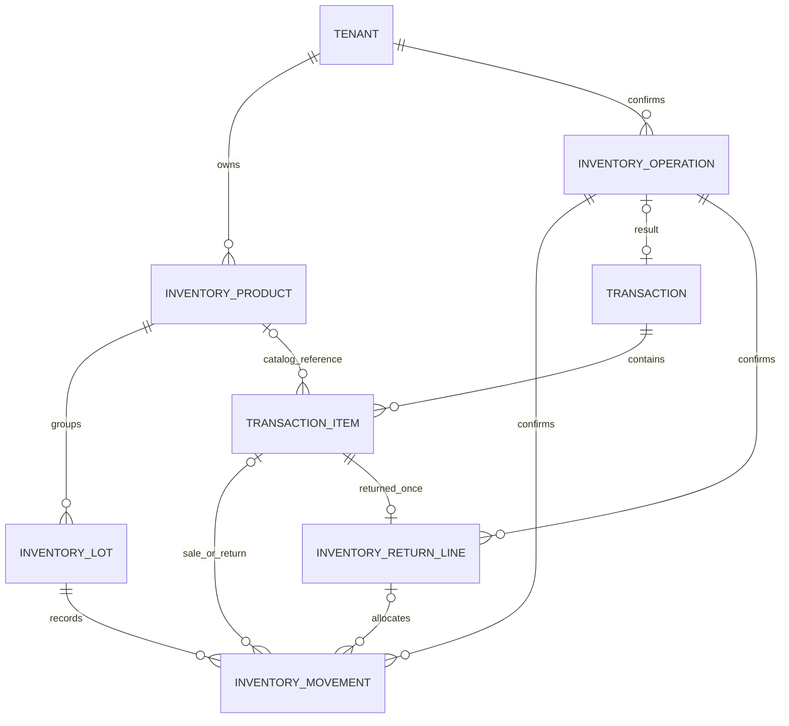

# Inventario — Etapa 4: modelo de persistencia

Fecha: 2026-10-02.

**Estado:** aprobado explícitamente el 2026-10-02 mediante «Sí, apruebo el modelo de datos», en respuesta a su solicitud de aprobación. Las Etapas 1, 2 y 3 ya estaban aprobadas. El [esquema físico de Etapa 5](inventory-physical-schema.md) fue aprobado explícitamente y se integró con migraciones aditivas locales. [Informe de implementación](../history/ENTREGABLE_INVENTARIO_COMPLETION_REPORT.md); publicación y VPS pendientes.

Fuentes: [casos de uso](inventory-workspace.md), [arquitectura aprobada](inventory-technical-design.md), [modelo conceptual](domain-model-v1.md), [ADR 015](../decisions/015-inventario-productos-insumos.md), [ADR 016 aprobado](../decisions/016-venta-inventario-atomica.md) y [regla de ejecución](../PHASE_2_EXECUTION_RULE.md).

Los nombres de esta etapa describen entidades y relaciones lógicas. Tipos Prisma, restricciones SQL, índices, claves físicas y código de migración se diseñarán en la Etapa 5; este documento no modifica la base de datos.

## 1. Decisiones de representación

1. Un producto es el agregado que coordina sus lotes y balances. No se crea un producto dentro de `Service` ni se transforma un servicio en mercancía.
2. Cada lote mantiene su balance actual como proyección. Cada cambio del balance conserva un movimiento inmutable en la misma transacción. El saldo no se obtiene de ventas incompletas ni se escribe desde el navegador.
3. Un movimiento representa una asignación concreta a un producto/lote. Una venta o consumo que usa dos lotes genera dos movimientos, unidos por su operación. No se esconde la distribución real en un campo de texto.
4. Una operación confirmada identifica el comando durable y su resultado. No sustituye a la venta financiera ni es un estado del carrito.
5. La devolución completa por línea conserva un marcador único y sus asignaciones originales. Una línea anulada no se considera devuelta por el solo estado financiero de su venta.
6. Los artículos financieros conservan una instantánea del producto vendido. El expediente de la mascota y las notas médicas no contienen el inventario ni son su fuente de verdad.

## 2. Entidades y agregados

### 2.1 Producto de Inventario

**Responsabilidad:** identidad, catálogo y política de uso del artículo físico dentro de un Establecimiento.

| Atributo lógico | Significado |
| --- | --- |
| Identidad y Tenant obligatorio | Referencia estable dentro del único límite de aislamiento |
| Nombre y categoría | Datos de catálogo administrables; categoría es una etiqueta, no el catálogo de servicios |
| Código interno y su forma normalizada | Identificador único dentro del Tenant |
| Código de barras opcional | Identificador de búsqueda exacta dentro del Tenant; conserva ceros iniciales |
| Presentación/unidad | Unidad entera de venta/consumo: caja, frasco, bolsa u otra presentación registrada |
| Usos | Destinos cerrados `retail`, `veterinary`, `grooming`; al menos uno |
| Costo de referencia | Dato administrativo vigente, distinto del costo de cada entrada |
| Precio de venta opcional | Obligatorio y positivo si tiene uso `retail`; insumo sin venta puede no tenerlo |
| Stock mínimo | Umbral no negativo de alerta |
| Política de lote y vencimiento | Sin control comercial, lote obligatorio o lote y vencimiento obligatorios |
| Activo | Permite nuevas operaciones ordinarias; desactivación no borra datos |
| Versión de metadatos | Control optimista de edición de catálogo |
| Versión de precio | Cambia cuando se modifica la tarifa de venta; una salida no la incrementa |
| Revisión de stock | Cambia con cada operación que modifica balances; no es la versión de precio |
| Fechas de creación/actualización | Instantes de servidor, sin sustituir el historial de movimientos |

**Reglas de evolución:** código/nombre/categoría/costo/precio/usos pueden editarse con versión vigente y permisos. La presentación y la política de lotes no se cambian después del primer movimiento; se registra otro producto. Desactivar no cambia cantidades ni versiones de precios por sí mismo.

No existe un campo mutable `stock` en este agregado además de los balances de lote. La cantidad física del producto se calcula sumando sus balances; disponibilidad filtra lotes no vencidos. La revisión del producto permite detectar conteos desfasados sin duplicar saldos.

El costo de referencia y la tarifa vigentes no pretenden valorar contablemente stock ni recalcular costos de entradas anteriores. La política de precio permanece en el resolver central.

### 2.2 Lote y balance

**Responsabilidad:** identificar mercancía con la misma trazabilidad y conservar sus unidades físicas registradas.

| Atributo lógico | Significado |
| --- | --- |
| Identidad, Tenant y producto | Lote de un producto específico del mismo Establecimiento |
| Tipo de agrupación | `commercial` si hay código comercial; `untracked` para mercancía sin control de lote |
| Código comercial / clave interna | Código obligatorio para lote comercial; agrupación interna única para producto sin lote |
| Vencimiento opcional | Día civil `YYYY-MM-DD`, sin hora; obligatorio cuando lo exige el producto |
| Balance físico | Unidades enteras no negativas actualmente registradas en ese lote |
| Primera entrada | Antigüedad para desempate/FIFO; no se reinicia cuando vuelve mercancía |
| Fechas de registro | Instantes del servidor |

Para un producto sin control de lote hay una sola agrupación interna, inicialmente con cero unidades. No se muestra al usuario un lote inventado. Las entradas de esa agrupación mantienen costos e identidad propios en sus movimientos.

Un código comercial no puede reutilizarse para el mismo producto con otra fecha de vencimiento, ni modificarse una vez usado. Una entrada adicional con el mismo producto/código/fecha incrementa el balance del mismo lote con otro movimiento de entrada; no sobrescribe su costo anterior.

`expired` no es un flag mutable persistido: se deriva del vencimiento y del día civil de consulta del servidor. Un lote que alcanza su fecha de vencimiento deja de estar disponible sin depender de un job. Su balance físico se conserva hasta que administración registra retirada/ajuste.

El balance, la revisión del producto y el movimiento se actualizan juntos. No se acepta un balance negativo ni un movimiento que apunte a un lote de otro producto o Tenant.

### 2.3 Movimiento de Inventario

**Responsabilidad:** evidencia inmutable de cada asignación física a producto/lote.

| Atributo lógico | Significado |
| --- | --- |
| Identidad, Tenant y operación | Hecho confirmado unido al comando que lo produjo |
| Producto y lote | Referencias estables; lote obligatorio incluso si su agrupación es interna |
| Tipo y cantidad | Motivo tipado y número positivo de unidades involucradas |
| Delta de balance | Cantidad que cambia el balance: positiva, negativa o cero según tipo |
| Balance anterior y resultante | Evidencia de la asignación bajo lock; resultante = anterior + delta, sin sustituir el saldo actual al recuperar |
| Fecha física | Instante de registro del servidor; nunca la fecha financiera elegida para una venta |
| Motivo | Obligatorio para ajuste, consumo sin atención, corrección y devolución |
| Identidad/nombre/rol del autor | Instantánea autenticada; no se elige desde el body |
| Instantánea del producto/lote | Nombre, código y presentación usados; código/fecha comercial cuando corresponde |
| Costo de entrada opcional | Obligatorio en entrada; no se rellena con el costo actual en filas históricas |
| Referencia de venta/línea opcional | Obligatoria en salida de venta y devolución; se conserva con el antecedente |
| Área y referencia de atención opcionales | Para consumo autorizado; no contiene notas clínicas ni prescripción |
| Referencia de movimiento original opcional | Para corrección o devolución; mismo producto/lote/Tenant |
| Datos de conteo opcionales | Cantidad contada, balance anterior y revisión utilizada para ajuste por conteo |

No se actualizan ni eliminan movimientos confirmados para «cuadrar» stock. Una corrección crea otro movimiento, vinculado al original cuando corresponde. El costo de una entrada anterior no se modifica al editar costo de referencia.

Cada movimiento lleva un ordinal único dentro de su operación para identificar sus asignaciones sin depender de un orden accidental de IDs. Los balances anterior/resultante se capturan en ese orden bajo exclusión del producto/lote. Recuperar un resultado histórico muestra esas cantidades como evidencia de aquella confirmación y etiqueta separadamente el saldo actual, que pudo cambiar después.

| Tipo lógico | Delta | Referencias y reglas |
| --- | --- | --- |
| `entry` | `+cantidad` | Costo de esta entrada; referencia documental opcional; incluye existencias iniciales |
| `sale` | `-cantidad` | Venta/línea catalogada y asignación de lote efectivamente utilizada |
| `consumption` | `-cantidad` | Área autorizada y atención o motivo de consumo |
| `adjustment_in` | `+cantidad` | Motivo y conteo/evidencia de corrección administrativa |
| `adjustment_out` | `-cantidad` | Motivo: diferencia, pérdida, daño o retiro de vencidos |
| `consumption_correction` | `+cantidad` | Movimiento de consumo original; compensación acumulada no supera lo consumido |
| `return_restock` | `+cantidad` | Salida original y marcador de devolución apta de la línea |
| `return_discard` | `0` | Salida original y recepción no reintegrable, con motivo; no habilita mercancía |

Una devolución no reintegrable registra las unidades recibidas y retiradas como evidencia de la devolución, pero no las reincorpora al balance físico contabilizado. Esto evita que el historial diga «no devuelto» sin crear disponibilidad para vender mercancía dañada/vencida. No se introduce una reserva o cuarentena de mercancía pendiente de evaluar: la disposición se confirma expresamente antes de registrar el hecho.

Un conteo sin diferencia se registra como operación confirmada con su evidencia y delta cero, **sin un movimiento ficticio de cantidad cero**. Repetir ese conteo con la misma clave recupera el resultado; uno nuevo exige nueva clave/revisión.

### 2.4 Operación confirmada

**Responsabilidad:** confirmar una sola ejecución y recuperar su resultado durable. Es soporte de aplicación, no otra entidad financiera ni otra unidad de aislamiento.

| Atributo lógico | Significado |
| --- | --- |
| Identidad y Tenant | Referencia de operación del establecimiento efectivo |
| Principal estable del actor | Staff ID o identidad administrativa autenticada normalizada; no depende del rol actual |
| Tipo de operación y clave de solicitud | Ámbito de idempotencia: Tenant + principal + tipo + clave |
| Versión del contrato de comando | Define cómo se normaliza e interpreta la huella |
| Huella del comando normalizado | Detecta misma clave usada con otro cuerpo; no almacena contraseña, token o tarjeta |
| Autor/nombre/rol al confirmar | Evidencia histórica; no concede permisos al recuperar |
| Fecha física de confirmación | Instante de servidor compartido con hechos físicos de la operación |
| Resultado tipado y referencia | Producto creado/editado, venta financiera, consumo, entrada, ajuste o devolución |
| Evidencia mínima del resultado | Versión de producto obtenida, conteo sin diferencia o referencias necesarias para mostrar el resultado original |

**Solo se persisten operaciones confirmadas.** La reclamación de la clave de la Etapa 3 es lógica dentro de la unidad de trabajo: comprobar un resultado previo y garantizar unicidad al escribir el resultado terminal. No se agrega una fila durable `pending`, `failed` o una reserva de stock separada.

Si dos peticiones nuevas intentan la misma clave, la transacción, locks y unicidad deciden cuál confirma. El intento perdedor revierte sus hechos y recupera el resultado confirmado si la huella coincide. La colisión de otro identificador —como un código de producto— no se interpreta indiscriminadamente como operación ya confirmada; se comprueba la referencia exacta al resultado.

Un rollback no deja operación ni resultado parcial. El estado temporal «enviando» pertenece a la interfaz; un GET que no encuentra resultado no afirma que una petición concurrente vaya a fracasar y solo habilita reintentar con la misma clave.

La huella incluye el tipo, versión del contrato y payload normalizado: identidades de referencias, líneas en su orden, cantidades, importes canónicos, versión/precio esperado, método de pago, notas y fecha explícita cuando existe. Excluye tiempo por defecto generado por servidor, nombre/rol actuales del actor y metadatos volátiles del navegador. Las políticas de normalización se conservan para poder comparar reintentos tras un despliegue.

Las claves confirmadas no se purgan mientras exista su hecho. Recuperar una venta anulada devuelve la venta con estado actual; no crea otra. Para una edición de catálogo posterior, la operación conserva la versión/resultado de aquella edición y la lectura actual se etiqueta por separado; un reintento no vuelve a aplicar la edición vieja.

El soporte durable no guarda una respuesta administrativa completa. DTO y lectura del resultado se vuelven a autorizar con los permisos y alcance actuales, incluidas las restricciones de lectura financiera del perfil. Una clave no concede acceso al archivo financiero general. Si el perfil no puede consultar ya un resultado, se informa la falta de acceso y se pide revisión administrativa sin habilitar una nueva confirmación que lo duplique. Desactivar Staff no borra su autoría ni permite a otra persona reclamar sus claves.

### 2.5 Marcador de devolución por línea

**Responsabilidad:** conservar el hecho de que una línea catalogada de venta anulada recibió su devolución completa, con aptitud y asignaciones.

| Atributo lógico | Significado |
| --- | --- |
| Identidad, Tenant y operación | Devolución confirmada dentro del comando administrativo |
| Venta y línea financiera | Referencias originales del mismo Tenant |
| Producto y cantidad de línea | Cantidad vendida completa; no se toma de un monto o descripción libre |
| Disposición | `restock` o `discard`, confirmada por administración |
| Motivo y fecha | Evidencia de recepción física distinta de la fecha de anulación |
| Movimientos asociados | Una asignación de devolución por cada salida/lote original |

Hay como máximo un marcador por línea financiera catalogada. Su cantidad debe coincidir con la línea completa y con la suma de asignaciones originales, independientemente del número de lotes. Otra clave no autoriza devolver otra vez esa línea.

Un marcador `restock` solo se confirma si todas las asignaciones a reintegrar siguen siendo aptas según la regla de vencimiento; producto desactivado no se reactiva. Un marcador `discard` conserva la recepción física no reintegrable sin aumentar balances. El historial financiero no se edita.

Una operación puede devolver varias líneas completas de la misma venta. Sus marcadores y movimientos se confirman juntos o se rechazan juntos. No se crea un reembolso bancario ni una devolución parcial de venta activa.

## 3. Evolución de las entidades financieras existentes

### 3.1 Transaction

Conserva monto, fecha financiera, método, actor, propietario/mascota, origen, estado y motivo de anulación existentes. Una operación `confirm_pos_sale` puede apuntar a una `Transaction` manual del mismo Tenant, creada en el mismo commit.

No hay una segunda tabla de «venta de inventario». Operación y movimientos referencian el hecho financiero existente. No cambia el significado del cobro de sistema ni se generan comisiones por mercancía o consumo.

### 3.2 TransactionItem

Se propone extensión aditiva para una línea catalogada:

- Identidad de Tenant para las líneas nuevas: permite verificar que artículo, venta y referencias de Inventario pertenezcan al mismo establecimiento.
- Referencia opcional de producto de Inventario; una línea manual conserva referencia nula y clasificación actual.
- Instantánea de código y presentación vendida.
- Origen de precio y versión de tarifa usados en la confirmación.

Descripción, cantidad, precio unitario y total existentes ya son la evidencia financiera de ese momento. La proyección de historial no sustituye su nombre por el nombre actual del producto ni recalcula el precio actual.

La pertenencia del Tenant del artículo debe coincidir con la venta padre, y una referencia de producto requiere `itemKind = product`. Para líneas catalogadas, los snapshots y referencia son obligatorios; para líneas históricas permanecen ausentes, sin inventar datos.

No se backfillean ventas antiguas como ventas de productos catalogados aunque coincidan descripción o precio. Sus unidades no se descuentan retroactivamente.

### 3.3 Asignación de stock a líneas financieras

Cada línea catalogada tiene movimientos `sale` cuya suma de cantidades iguala exactamente `TransactionItem.quantity`. Una línea con cantidad 4 que usó 1 unidad del lote A y 3 del lote B conserva ambas asignaciones; una devolución completa utiliza exactamente A:1/B:3.

Movimientos financieros y físicos se relacionan por identidades del mismo Tenant, no por descripción, nombre de mascota o código de producto mutable. La representación física de referencias compuestas se decidirá en Etapa 5 para hacer verificable este aislamiento en PostgreSQL.

## 4. Agregados, invariantes y unidad de trabajo

| Agregado / hecho | Invariantes principales |
| --- | --- |
| Producto y lotes | Política/presentación estable después de movimientos; balances enteros no negativos; revisión de stock y hechos coherentes |
| Movimiento | Una operación confirmada, un producto/lote del mismo Tenant y delta compatible con su tipo; no se edita ni borra |
| Operación | Una huella y resultado por Tenant/principal/tipo/clave; resultado existente, sin estado durable ambiguo |
| Venta y artículos | Una venta manual con todas sus líneas y snapshots; guard de extras y reglas financieras conservados |
| Devolución de línea | Venta anulada, cantidad completa, máximo un marcador, mismos lotes de la salida y ninguna reposición de vencidos/no aptos |
| Corrección de consumo | Fuente de consumo del mismo producto/lote/Tenant; compensación acumulada acotada a cantidad original |

La operación de venta abarca varios productos y un agregado financiero. Sus invariantes se coordinan en una unidad de trabajo, con locks ordenados por producto. Movimiento, modificación de balances, incremento de revisión, venta/artículos y referencia de operación se confirman juntos.

Al registrar varias asignaciones de un mismo producto, la revisión aumenta una vez por operación que cambia su balance, no una vez por línea del carrito. La versión de precio no cambia por esta venta. Contar sin diferencia no altera balance/revisión; conserva el hecho de conteo en el resultado de operación.

Las restricciones locales —balance no negativo, tipo/delta, campos obligatorios y referencias de Tenant— se trasladarán al esquema físico cuando sea posible. Invariantes entre varias filas —sumas de asignaciones, compensaciones acumuladas, saldo/movimientos y aptitud vigente— se validan por los casos de uso bajo locks y pruebas con PostgreSQL real. No se declara que una clave foránea por sí sola verifique esas sumas.

Se podrá reconciliar administrativamente la proyección de un lote con la suma de deltas de sus movimientos confirmados. La primera entrega verifica esta igualdad en pruebas; no expone un endpoint de «reescribir saldo» ni promete un job automático de reconciliación. Si se detecta discrepancia, se investiga el origen sin borrar evidencia.

## 5. Fechas, números y snapshots

- Vencimiento es un día civil del establecimiento, no un instante elegido a medianoche por el navegador. Se considera no disponible desde el comienzo de ese día conforme a la regla aprobada.
- Fecha física de operación/movimientos procede del servidor. Fecha de cobro financiero sigue su contrato; no se usa para retroceder stock ni reevaluar un lote como si todavía no hubiera vencido.
- Balance, cantidad involucrada y stock mínimo son enteros. Precio/costo son decimales monetarios con dos decimales y límites existentes; no se guarda dinero en floats ni se introducen conversiones de presentación.
- Movimientos guardan snapshot de producto/presentación y autor; la venta guarda el suyo propio para su comprobante. Cambiar nombre de Staff o producto no reatribuye antecedentes.
- El costo de una entrada es administrativo, no un campo derivado que recepción o profesionales deban recibir. Un DTO operativo no incluye costos aunque el movimiento los conserve.
- Las versiones de catálogo/precio y revisión de stock son monotónicas. Sus límites físicos y control de desbordamiento se especificarán en Etapa 5.

## 6. Relaciones y aislamiento

El diagrama muestra cardinalidades lógicas; una `Transaction` histórica puede no tener operación de Inventario. Un `TransactionItem` manual no tiene producto ni movimientos de stock. Una operación de entrada o consumo no tiene transacción financiera. Un marcador de devolución requiere la línea catalogada, no cualquier artículo por descripción.

Tenant es obligatorio en todos los hechos nuevos de Inventario. Las relaciones producto/lote/movimiento/operación y las referencias financieras se validan en el mismo Tenant. No se introduce organización, bodega por sucursal ni acceso global como fallback.

Los datos históricos de `Transaction` pueden tener Tenant nullable según el esquema vigente. Eso no autoriza crear referencias nuevas de Inventario sobre una venta sin establecimiento verificable. La compatibilidad nullable en campos añadidos a líneas históricas no implica que el dominio nuevo acepte Tenant vacío.

La credencial del Staff permanece en Staff; ningún hecho contiene su contraseña/token. Snapshot del principal evita perder autoría al desactivar una cuenta; no existe un borrado en cascada desde Staff que elimine movimientos. El acceso a datos actuales se verifica contra la identidad vigente, no contra los permisos que existían al registrar el snapshot.

## 7. Retención y correcciones

- Producto con antecedentes se desactiva; no se elimina físicamente. Lote con antecedentes conserva identidad y vencimiento.
- Movimiento, operación confirmada y marcador de devolución no admiten borrado operativo ni actualización de su hecho. La protección física específica se diseña en Etapa 5.
- La anulación financiera conserva todos los artículos y asignaciones. No dispara una cascada que borre movimientos o la clave que permite recuperar la venta.
- Un snapshot no se recalcula por cambios de catálogo. Para corregir evidencia se registra otro hecho con motivo y referencias apropiadas.
- Devolución o compensación posterior puede existir con el producto desactivado sin reactivar ventas. No reabre ni reescribe un cierre financiero anterior.
- Si una devolución fue registrada con aptitud equivocada, su antecedente permanece. Cualquier corrección física se registra como ajuste administrativo con motivo/referencia; no se borra el marcador para devolver por segunda vez.

## 8. Evolución desde los datos actuales

La incorporación será aditiva: entidades nuevas vacías, campos adicionales compatibles en líneas financieras y nuevas referencias. La migración no genera entradas a partir de ventas ni interpreta descripciones antiguas como códigos de producto.

El stock inicial requiere registrar cantidades físicamente verificadas por administración, con entrada «Existencias iniciales», costo y lote/vencimiento cuando corresponda. El dato no se toma de ejemplos de frontend ni de registros de mascotas.

La extracción de venta manual a Finanzas conserva su contrato; la nueva interfaz confirmará todas sus ventas con clave. Los adaptadores legados sin clave no pueden enviar artículos catalogados. No hay una ruta alternativa que use saldos sin movimiento.

Los scripts de comprobación local deberán crear fixtures con prefijo propio, aislar operaciones del Tenant local y limpiarlas explícitamente. Una vez existan restricciones de retención, la limpieza de fixtures debe respetar el grafo de referencias y un procedimiento de pruebas separado del aplicativo; no se agregará un endpoint de borrado de hechos de producción para facilitar tests.

## 9. Casos de validación del modelo

| Escenario | Resultado durable esperado |
| --- | --- |
| Entrada de 10 unidades | Balance +10, un movimiento de entrada y una operación confirmada con costo de esa entrada |
| Venta de 4 desde A:1/B:3 | Una Transaction/línea catalogada, dos movimientos de salida, balances coherentes, una operación |
| Timeout después del commit | La misma clave encuentra venta y dos asignaciones; no genera otra operación ni salida |
| Misma clave y otro cuerpo | Rechazo; ninguna nueva venta, ajuste o movimiento |
| Cambio de precio o nombre | Datos actuales actualizados; comprobante y snapshots anteriores conservados |
| Lote llega al vencimiento | Balance físico conservado; disponibilidad cero para ese lote, sin movimiento de desaparición |
| Anulación sin devolución | Transaction anulada; movimientos de salida intactos, sin marcador ni reposición |
| Devolución apta de esa línea | Un marcador y asignaciones A:1/B:3 compensatorias; solo una devolución permitida |
| Devolución dañada | Un marcador `discard` y movimientos delta cero; no aumenta stock disponible |
| Conteo sin diferencia | Operación con evidencia; sin movimiento ficticio ni cambio de balance |
| Corrección de consumo repetida | Compensaciones acumuladas nunca exceden el consumo original |
| Staff desactivado / otro Tenant | Autoría histórica conservada; operación nueva/recuperación no autorizada rechazada |

## Verificación de esta preparación documental

Ejecutada el 2026-10-02; verifica el estado actual y los documentos, no una implementación de Inventario.

- En `frontend/`, `npm run lint`: `> frontend@0.1.0 lint` / `> eslint`, salida 0 sin diagnósticos.
- En raíz, `node --test scripts/pos-checkout.test.cjs scripts/pos-draft-history.test.cjs`: `tests 12`, `pass 12`, `fail 0`, salida 0.
- En `backend/`, `npm test -- --runInBand src/contexts/finance/__tests__/pos`: `Test Suites: 3 passed, 3 total`, `Tests: 18 passed, 18 total`, salida 0.
- Seis documentos de Inventario, modelo conceptual y ADR: cero enlaces locales rotos; arquitectura aprobada, persistencia propuesta y esquema/implementación pendientes claramente separados.
- `git diff --check -- docs/architecture/domain-model-v1.md`: salida 0. Sin modificación del esquema Prisma ni migración ejecutada.

## 10. Paso siguiente

La aprobación de este modelo habilitó la **Etapa 5 — Esquema físico**, preparada en [su documento](inventory-physical-schema.md): Prisma, aislamiento, checks, índices, hechos inmutables y migración aditiva. Se validó su SQL en un esquema privado dentro de una transacción revertida; no se aplicó migración al aplicativo ni se ejecutó `db push` o `prisma generate`.

## Decisiones arquitectónicas diferidas

Se conservan las exclusiones de las Etapas 2 y 3: unidades fraccionarias, valoración contable, múltiples bodegas, compras/cuentas por pagar, devoluciones comerciales parciales, prescripción normativa, outbox productor nuevo y operación offline. No se crean entidades para prometer esas capacidades.

Tipos, índices y restricciones físicos no se omiten: están concretados en la Etapa 5 que requiere aprobación. La persistencia durable de la confirmación, snapshots, balances y movimientos sí forma parte de este modelo aprobado.
