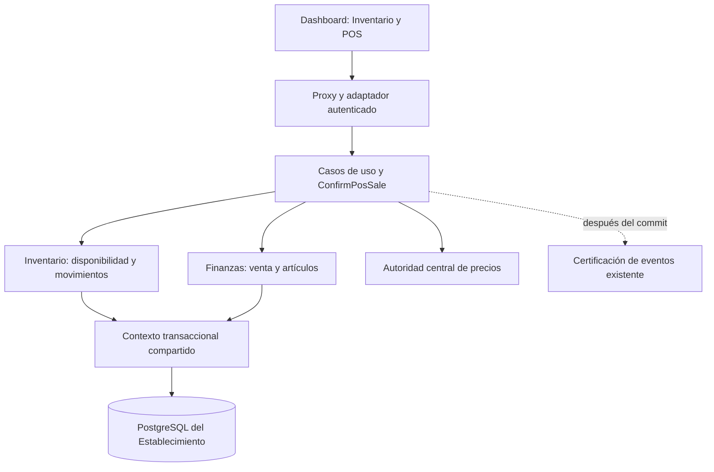

# Inventario — Etapa 3: arquitectura técnica

Fecha: 2026-10-02.

**Estado:** aprobada explícitamente el 2026-10-02 mediante «acepto», en respuesta a la solicitud de aprobación de esta arquitectura. Los casos de uso ya estaban aprobados mediante «acepto empieza». El [modelo de persistencia de Etapa 4](inventory-persistence-model.md) fue aprobado después mediante «Sí, apruebo el modelo de datos». El [esquema físico de Etapa 5](inventory-physical-schema.md) fue aprobado mediante «Sí, apruebo; empieza la implementación». Integración local completada, con [evidencia](../history/ENTREGABLE_INVENTARIO_COMPLETION_REPORT.md); publicación y VPS pendientes.

Fuentes: [casos de uso aprobados](inventory-workspace.md), [modelo conceptual](domain-model-v1.md), [ADR 015](../decisions/015-inventario-productos-insumos.md), [ADR 016 aprobado](../decisions/016-venta-inventario-atomica.md), ADR 007 (cobros), ADR 008 (día civil), ADR 009 (inmutabilidad financiera) y [regla de ejecución](../PHASE_2_EXECUTION_RULE.md).

## 1. Evidencia del sistema actual

La investigación se realizó sobre el repositorio local, incluidos los cambios del POS aún no publicados.

| Pieza existente | Comportamiento observado | Consecuencia para Inventario |
| --- | --- | --- |
| `routes/dashboard/transactions.routes.js` | POST valida artículos y crea `Transaction`/`TransactionItem` directamente con Prisma | Extraer el comando de venta; una ruta HTTP no coordinará venta y stock |
| `contexts/finance/application/use-cases/pos/guard-manual-sale-link.usecase.js` | Una venta vinculada a cita solo representa extras; exige cita completada con cobro de sistema | Reutilizar esta regla dentro de la transacción, sin duplicar el servicio cobrado |
| `contexts/finance/application/use-cases/pos/void-manual-sale.usecase.js` | Solo anula venta manual; conserva importe/artículos y rechaza día cerrado | Reutilizar anulación financiera; no convertirla en devolución automática |
| `contexts/finance/infrastructure/persistence/prisma-transaction.repository.js` | Algunos métodos admiten `ctx.tx`, otros usan el cliente global | Los métodos usados por el nuevo comando necesitan propagar el contexto transaccional |
| `contexts/shared/persistence/prisma-unit-of-work.js` | Transacción compartida mediante `run(fn)` y contexto opaco | Ampliación compatible para opciones de aislamiento; el comportamiento de consumidores actuales permanece por defecto |
| `services/dashboard-access.service.js` | Perfiles y permisos `cash`/`appointment_price`; módulos `veterinary`/`grooming`/`retail` | Añadir consumo explícito y capacidades efectivas, sin añadir otro rol o módulo |
| `services/domain/price-resolver.service.js` | Única autoridad; exporta `resolvePrice` y `resolveAppointmentPrice` | Extensión aditiva para precio de producto; no introducir otra política de precios |
| `contexts/shared/business-day.js` y `lib/timezone.js` | Primitivas de día civil de Bogotá | Reutilizar para vencimiento, fechas y alertas; no usar el reloj del navegador |
| `contexts/shared/events/certifying-domain-event-publisher.js` | Certifica con el mecanismo existente; los fallos no se propagan | Eventos informativos después de commit; no sustituir la atomicidad de stock con eventos |

No existe un modelo `Product` o `InventoryItem` en Prisma, ni comandos de stock. `TransactionItem.itemKind = product` clasifica un artículo manual; no significa que tenga existencias controladas.

## 2. Límites y organización de la solución

### 2.1 Contextos y capa de aplicación

- **Inventario:** `backend/src/contexts/inventory/`, con `domain/`, `application/use-cases/`, `application/ports/` e `infrastructure/`. Mantiene productos, lotes, saldos y movimientos. No escribe dinero, historias clínicas ni comisiones.
- **Finanzas:** mantiene `Transaction` y sus artículos. Incorporará `RegisterManualSaleUseCase`, extrayendo el registro manual que hoy vive en la ruta. No conoce repositorios de Inventario ni decide disponibilidad.
- **Coordinación de venta:** `backend/src/application/workflows/pos/`, con un caso de uso `ConfirmPosSale` y contratos inyectados de Finanzas e Inventario. Es capa de aplicación, no un nuevo bounded context ni un canal. Se ensambla en `backend/src/contexts/index.js`, donde ya se coordina Agenda, Staff y Finanzas.
- **HTTP:** un adaptador traduce sesión y petición a comandos tipados; devuelve DTO autorizado o error. Sin consultas Prisma para decidir stock ni cálculo de precio en rutas.
- **Frontend:** usa el proxy autenticado y el manifiesto de acceso efectivo; muestra datos del servidor. Un Portal o API autorizados podrían invocar los mismos casos de uso sin modificar su dominio.

Las flechas hacia la unidad de trabajo expresan repositorios que reciben el mismo contexto opaco; no sugieren que cada contexto abra su propia transacción.

### 2.2 Puertos y contratos internos

| Puerto / servicio | Responsabilidad |
| --- | --- |
| `ProductRepository` | Obtener producto del Tenant, controlar versión de metadatos y adquirir exclusión de mutación |
| `StockRepository` | Leer lotes/balances, asignar salida por FEFO/FIFO y actualizar saldos con precondición de cantidad |
| `MovementRepository` | Registrar hechos físicos inmutables y consultar referencias para devolución/corrección |
| `OperationRepository` | Reclamación de clave de operación, huella del comando y resultado confirmado |
| `InventoryPolicyReader` | Usos permitidos del producto y política vigente del establecimiento |
| `AccessReader` | Verificar identidad/credencial vigente, rol, módulos y permisos; aportar snapshot de autor |
| `SalePort` de Finanzas | Validar contrato financiero y vínculo con cita; crear venta y artículos en `ctx` |
| `SaleReader` de Finanzas | Proyección mínima y tenant-scoped de venta, estado, líneas y cantidades originales para devolución |
| `AttentionAccessReader` | Proyección mínima de área, responsable y estado de atención; no exponer notas médicas |
| `UnitOfWork` | Ejecutar una confirmación completa en una sola transacción y notificar solo después de commit |
| `Clock` / `BusinessDay` | Instante de servidor y día civil con primitivas existentes |
| Autoridad central de precios | Resolver tarifa de producto y de servicios conservando semánticas diferentes |

Todos los métodos de persistencia que participan en una confirmación reciben `ctx`; utilizan `ctx.tx` y nunca hacen fallback al cliente global dentro del comando. Fuera del comando se conserva el uso compatible del repositorio existente.

Los lectores de otros contextos se inyectan desde composición. Inventario no importa modelos Prisma de Finanzas o Clínica para reconstruir reglas por su cuenta. La identidad, Tenant y snapshot del autor se derivan del contexto autenticado, no del body.

La extracción prevista de Finanzas añade `createManualSale(data, ctx)` y propagación compatible de `ctx` a `guardManualSaleLink`, `findActiveByAppointment` y al lector de cita usado por ese guard. El comando existente sin `ctx` conserva su comportamiento; dentro de `ConfirmPosSale` se exige el contexto de la unidad de trabajo. Los publishers de ese comando reciben un colector de hechos que solo se entrega al certificador después de commit, sin cambiar el publisher global usado por consumidores anteriores.

## 3. Confirmación atómica de una venta

### 3.1 Contrato de entrada

El endpoint existente POST `/api/dashboard/transactions` evoluciona manteniendo el contrato de líneas manuales. Una confirmación nueva desde POS añade `Idempotency-Key` (UUID aleatorio conservado durante reintentos) y puede mezclar:

- **Servicio manual:** descripción, cantidad, importe acordado y `itemKind = service`, como actualmente.
- **Producto manual sin control:** descripción, cantidad, importe y `itemKind = product`, sin `productId`; se identifica explícitamente como «Sin control de inventario».
- **Producto catalogado:** `itemKind = product`, `productId`, cantidad, precio esperado y versión de precio obtenidos del catálogo. El servidor obtiene descripción, presentación y precio efectivo; no confía en una descripción enviada para sustituir la identidad. Una combinación contradictoria de tipo/ID se rechaza, no se convierte por defecto a servicio.

Opcionales existentes: propietario, mascota, método de pago, notas y vínculo con cita. Fecha de cobro mantiene las restricciones de administración actuales. **La fecha física de una salida siempre es la de su registro en servidor**, aunque un administrador registre una fecha financiera distinta.

Si una petición contiene `productId`, requiere clave idempotente y el caso de uso de Inventario. Un adaptador legado nunca puede ignorarlo y registrar esa línea como manual. La interfaz no ofrece convertir una línea catalogada rechazada por stock en una línea manual; estas últimas permanecen como una operación explícita sin control, no una garantía de disponibilidad.

La interfaz actualizada usa clave para todas las ventas, incluso las que solo llevan servicios. La compatibilidad de peticiones manuales antiguas sin clave se limita al comando financiero extraído, sin artículos catalogados ni garantía nueva de recuperación durable. No existe una ruta alternativa sin clave que pueda descontar Inventario.

### 3.2 Secuencia dentro de PostgreSQL

1. Validar forma y límites del comando, normalizarlo y producir huella estable. La clave se vincula a Tenant, actor autenticado estable y tipo de operación.
2. Abrir unidad de trabajo con aislamiento `Serializable` para el comando nuevo. Revalidar identidad, credencial, rol y módulos vigentes en el contexto transaccional.
3. Reclamar la operación dentro de la transacción. Si ya existe una confirmación del mismo actor/Tenant, verificar huella y devolver su identidad de resultado; si la clave se usó para otro comando, rechazar sin cambios.
4. Validar propietario/mascota/cita del Tenant mediante contratos existentes. El guard de vínculo conserva la regla de extras y consulta en el mismo `ctx`.
5. Agregar cantidades por producto para validar stock, aunque el producto aparezca en varias líneas. Adquirir locks de productos en orden estable por ID; sus mutaciones de catálogo, entradas, ajustes y devoluciones usan la misma exclusión. Así se evita asignar stock desde una vista obsoleta o cambiar política de lotes durante una salida.
6. Resolver precios vigentes mediante la autoridad central. Comparar precio esperado/versión para productos. Validar lotes y disponibilidad con el día civil del servidor. Orden de asignación: vencimientos vigentes primero, ascendente por fecha; después lotes sin vencimiento por antigüedad de entrada; ID como desempate determinista.
7. Preparar todas las asignaciones; ante stock insuficiente, precio cambiado o referencia inválida, rechazar el comando completo. No descartar líneas ni sustituir lotes vencidos por cantidades negativas.
8. Finanzas crea una venta `manual_pos_sale` y todos sus artículos mediante su caso de uso. Inventario descuenta saldos con condición `cantidad actual >= salida` y escribe movimientos vinculados a las líneas/lotes efectivos. La identidad del artículo se devuelve al coordinador; Inventario no calcula dinero.
9. Registrar el resultado confirmado y sus referencias en la operación idempotente, en la misma transacción. Revalidar el día civil antes de terminar si cambió durante la asignación; en ese caso, abortar y recalcular bajo el nuevo día.
10. Commit. Solo después se permite mostrar venta exitosa o publicar notificaciones. El recibo y la respuesta se reconstruyen desde datos confirmados, filtrados por autorización.

No hay éxito parcial entre dinero y mercancía. La unidad de trabajo no ejecuta HTTP externo, WhatsApp, OpenAI, impresión ni pagos bancarios.

### 3.3 Concurrencia y recuperación

- El lock del producto coordina todas las mutaciones de sus lotes; el aislamiento y las actualizaciones condicionadas protegen lecturas y saldos. Las restricciones SQL definitivas se diseñan en Etapa 5.
- Conflictos de serialización (`P2034`) permiten hasta tres intentos internos; cada intento vuelve a leer precios, accesos y balances y conserva la misma clave. Agotados, se devuelve un conflicto recuperable sin afirmar éxito.
- Una colisión de unicidad de clave (`P2002` específico de esa restricción) se resuelve leyendo la operación confirmada fuera de la transacción fallida y comparando huella. No se interpreta cualquier `P2002` como un cobro duplicado.
- Operación y resultado se escriben juntos. Si hay rollback o crash previo al commit, no queda venta ni salida parcial. Si el commit ocurrió pero se perdió la respuesta, repetir el mismo comando/clave recupera el resultado original.
- El cliente no genera una clave nueva por timeout. GET `/api/dashboard/pos/operations/:key` permite recuperar estado; un 404 puede significar que otro intento aún no confirmó. Autoriza únicamente repetir **la misma clave**, no una nueva venta.
- La clave no vence mientras exista el hecho que identifica. Recuperar una venta que posteriormente se anuló devuelve su estado actual; jamás produce otra venta activa.
- Recuperación exige acceso e identidad vigentes. Un cambio de perfil o credencial puede impedir lectura/reintento, aunque exista el antecedente; el servidor no recupera permisos del estado de una operación vieja. Una identidad o Tenant ausentes se rechazan expresamente, sin activar valores administrativos por defecto.
- El estado durable guarda referencias a resultados y huella, no una respuesta completa con costos potencialmente prohibidos ni datos bancarios. Su forma exacta pertenece a Etapa 4.

**Detalle de persistencia aprobado después de esta arquitectura:** la Etapa 4 representa la reclamación lógica mediante comprobación y unicidad del resultado terminal dentro de la transacción. Guarda solo operaciones confirmadas, sin filas durables de reserva/pending; el lock y la transacción siguen siendo los de esta arquitectura. Su [modelo](inventory-persistence-model.md) recibió aprobación explícita; la [Etapa 5](inventory-physical-schema.md) concreta FK diferidas del resultado, aún sin integración al aplicativo.

## 4. Productos, lotes y movimientos

### 4.1 Gestión del catálogo

Crear producto, cambiar metadatos/precio, activar/desactivar, registrar entrada y ajustar son comandos de Inventario. Cambios de catálogo exigen versión vigente para evitar que un editor sobrescriba otro. Cambios de presentación o política de lotes tras movimientos se rechazan conforme a los casos de uso aprobados.

Se separa la versión de metadatos/precio de la revisión de existencias: una venta de otro operador puede cambiar stock sin convertir por sí sola un precio en obsoleto. La cantidad se vuelve a comprobar en servidor.

Cada entrada/ajuste/consumo/devolución exige clave de operación; creación y modificación del catálogo también la usan para poder recuperar una confirmación ambigua sin duplicar productos. Un mismo comando con la misma clave mantiene su resultado; volver a editar es una operación distinta con una nueva clave y versión esperada.

Entradas y ajustes necesitan cantidad/costo/motivo validados por dominio. Productos sin lote comercial se administran en una agrupación interna de existencias por producto; no se expone un lote ficticio al usuario. Productos controlados mantienen lote comercial y vencimiento, y se bloquea reutilizar el mismo lote con otra fecha.

El saldo es una proyección actualizada en la misma transacción que su movimiento. Nadie puede editar el saldo sin registrar un hecho. Las unidades físicas vencidas permanecen en saldo hasta su retiro administrativo; la disponibilidad se calcula filtrando lotes aptos con el día de consulta, sin depender de un job que «expire» stock.

### 4.2 Precio y dinero

Añadir `resolveProductPrice({ productBasePrice })` y el origen `product_base_price` a `price-resolver.service.js` como extensión aditiva. Devuelve resolución trazable o precio no resuelto; no acepta precio por mascota ni override de servicio para mercancía. El contrato existente de `resolvePrice` y su jerarquía conserva exactamente su comportamiento.

Inventario expone datos de catálogo, pero no implementa una segunda política de precio. El lector de catálogo y el coordinador consultan la misma autoridad. Ningún controlador o componente decide por su cuenta qué precio efectivo usar.

Importes entran como cadenas decimales canónicas de dos decimales en los DTO nuevos; el adaptador conserva compatibilidad con los números válidos actuales. La validación financiera convierte a centavos enteros y comprueba límites existentes de `Decimal(10,2)` antes de persistir. Cantidades son enteros positivos de la presentación aprobada. No se amplían límites por el hecho de añadir stock.

El precio/costo mostrado de un producto no recalcula movimientos anteriores. El costo de entrada es evidencia administrativa; no promete costo promedio, margen contable ni valoración del inventario.

### 4.3 Consumo profesional

`RegisterInventoryConsumption` verifica el producto destinado a esa área, permiso `inventory_consume` y módulo vigente (`veterinary` o `grooming`). Se añade esta habilitación al vocabulario cerrado de acceso; es independiente de `cash` y `appointment_price`.

El caso de uso valida referencia de atención con un lector autorizado que devuelve solo identidad, Tenant, área y atribución necesarias. Sin atención, exige un motivo explícito dentro del área autorizada. No recibe `staffId` elegido por el navegador como autor y no lee ni escribe texto clínico.

Utiliza la misma asignación FEFO/FIFO y unidad de trabajo que una salida de venta, pero no invoca Finanzas ni genera cobro/comisión. Corregir un consumo requiere administración, motivo, referencia al movimiento original y otro movimiento; no borra el primero ni permite compensar más unidades que las consumidas.

### 4.4 Ajustes de conteo

`AdjustInventoryFromCount` incluye producto/lote, cantidad física contada, revisión de saldo esperada y motivo. Bajo lock, compara la revisión actual: si hubo otra entrada/salida, devuelve `STOCK_COUNT_CHANGED` para volver a contar/revisar. La revisión de stock se actualiza con todos los movimientos; no se usa la versión de precio.

Daño, pérdida y retiro de vencidos son salidas identificadas. Un incremento para corregir mercancía física vencida no vuelve apto el lote. No se genera egreso financiero automáticamente.

### 4.5 Anulación y devolución

POST `/transactions/:id/void` mantiene el caso de uso financiero vigente, su restricción de venta manual y frontera de cierre. Ningún consumidor del evento `VentaAnulada` repone existencias automáticamente.

`RegisterInventoryReturn` es una operación separada: valida mediante `SaleReader` que la venta pertenece al Tenant, está anulada y contiene la línea catalogada. Adquiere lock del producto y de la referencia de devolución; registra una devolución completa por línea como máximo una vez. Las asignaciones efectivas de la salida fijan producto/lotes y cantidad; el navegador no puede escoger otro destino.

- **Apta:** repone al producto/lote original y registra movimientos compensatorios vinculados a la salida. Si el lote está vencido en el día actual, se rechaza clasificarlo como apto.
- **No reintegrable:** registra recepción física y motivo, sin aumentar existencias disponibles ni físicas del stock apto. El historial conserva que la mercancía se recibió para retirada, no que puede venderse.
- Repetir misma clave recupera resultado. Una clave diferente para la misma línea ya devuelta no repone otra vez; devuelve estado de devolución existente o conflicto identificable.
- Se permite devolución posterior de producto desactivado, sin reactivarlo ni modificar cierre financiero. Una devolución no ejecuta reembolso bancario.

La anulación y la devolución tienen fechas, responsables y motivos distintos. Se preserva el contrato financiero anterior; no se implementa devolución parcial comercial ni anulación de cobro de sistema.

## 5. Autorización, aislamiento y DTO

El manifiesto de acceso añade capacidades efectivas `inventory_read`, `inventory_manage` e `inventory_consume`; solo `inventory_consume` es habilitación adicional asignable a profesionales. Administrador tiene gestión dentro del Tenant efectivo; no recibe una vista global por ausencia de tenant.

- Lecturas de venta: administrador, recepción o profesional con Caja, y Pet shop activo. Filtrar productos destinados a venta.
- Lecturas de insumos: administrador o profesional con consumo y su módulo activo; filtrar usos a su área.
- Administración: catálogo, costos, entradas, ajustes, movimientos completos y devoluciones.
- Operaciones profesionales: solo consumo de su área, con las mismas restricciones de atenciones que el módulo profesional.

DTO operativos incluyen identidad, presentación, precio autorizado, disponibilidad y alertas necesarias. No incluyen costo de entrada, costo de producto, valor contable, notas médicas ni datos de otra área. Un lector administrativo independiente compone esos campos después de autorizar.

Todas las consultas y locks de referencias aplican Tenant explícito. Una referencia ajena se responde como inexistente, sin revelar a quién pertenece. Crear producto/movimiento nunca acepta `tenantId`, rol, autor o snapshot del body. La selección administrativa de establecimiento reutiliza la resolución autenticada vigente, no se convierte en identidad libre dentro del comando.

La nueva habilitación se administra desde Equipo reutilizando Staff/credenciales; no se crea un segundo acceso profesional. Módulos desactivados bloquean salidas propias del área; administración conserva lectura y corrección de antecedentes.

## 6. Adaptador HTTP propuesto

Prefijo autenticado `/api/dashboard`; navegador mediante `proxyUrl`, Server Components mediante `apiUrl + makeServerHeaders`.

| Método y recurso | Contrato principal | Autorización |
| --- | --- | --- |
| GET `/inventory/products` | Búsqueda, código/barra, uso, estado, categoría, cursor; disponibilidad/alertas | Lectura efectiva filtrada |
| GET `/inventory/products/:id` | Detalle operativo o administrativo según permiso | Lectura efectiva |
| POST `/inventory/products` | Crear producto, clave idempotente | Administración |
| PATCH `/inventory/products/:id` | Metadatos/precio/estado, versión y clave | Administración |
| POST `/inventory/products/:id/entries` | Cantidad, costo, lote/fecha, motivo y clave | Administración |
| POST `/inventory/products/:id/adjustments` | Conteo/diferencia, revisión esperada, motivo y clave | Administración |
| POST `/inventory/consumptions` | Producto, cantidad, área, atención o motivo y clave | Administración o consumo autorizado |
| POST `/inventory/consumptions/:id/corrections` | Referencia de consumo y compensación justificada con clave | Administración |
| GET `/inventory/products/:id/movements` | Historial paginado y lotes por producto | Administración |
| POST `/transactions` | Venta existente, artículos de catálogo y clave | Caja; módulos por línea |
| GET `/pos/operations/:key` | Resultado confirmado de la operación del actor actual | Actor y operación autorizados |
| GET `/inventory/operations/:key?kind=...` | Recuperación por tipo cerrado de entrada/ajuste/consumo/devolución o mantenimiento del catálogo | Actor y operación autorizados |
| POST `/transactions/:id/inventory-returns` | Líneas completas, aptitud, motivo y clave | Administración |

Las colecciones son paginadas con límite máximo de 100, cursor opaco ligado a filtros y orden estable. El frontend no presenta una suma de página como total de existencias del negocio. Buscar por código es coincidencia exacta; buscar por nombre permite texto normalizado. Cambiar filtros cancela resultados anteriores. La recuperación de Inventario exige `kind` del vocabulario cerrado, porque la misma clave tiene ámbito por tipo; la recuperación del POS fija el tipo `confirm_pos_sale` en su adaptador.

**Respuesta de conflicto:** código legible por máquina, mensaje comprensible y referencias mínimas autorizadas. Ejemplos: `INSUFFICIENT_STOCK`, `PRICE_CHANGED`, `PRODUCT_CHANGED`, `STOCK_COUNT_CHANGED`, `OPERATION_KEY_REUSED`, `RETURN_ALREADY_REGISTERED`. `403` para permiso, `404` para referencia inexistente/ajena, `409` para conflicto, `422` para regla de negocio, `503` para indisponibilidad reconocida. Un `500`/timeout nunca demuestra que no hubo commit.

El proxy deja pasar `Idempotency-Key` solo con autenticación del servidor y límites de longitud/formato. No pasa cabeceras elegidas por el navegador como autor, rol o Tenant.

## 7. Diseño del adaptador frontend

### Inventario

Nuevo acceso **Inventario** bajo Gestión; aparece según manifiesto de permisos, aunque no haya Pet shop cuando el usuario gestiona/consume insumos autorizados. El administrador ve catálogo, existencias/lotes y movimientos. El perfil operativo ve los productos e insumos habilitados para su función.

La primera pantalla prioriza búsqueda por nombre/código, filtros, unidades disponibles, presentación, precio autorizado y alertas. Los indicadores de costo quedan exclusivamente en la vista administrativa. «Sin existencias» y «Vencido» no se comunican solo con color.

Formularios centrados, con etiquetas visibles: producto, presentación, cantidad, costo por unidad, lote y fecha. El stock inicial es una entrada explícita después de crear producto; nunca un campo silencioso que reescriba saldo.

### POS

Conserva el carrito actual, servicios, propietario/mascota opcionales, métodos de pago y recibo persistido. Añade selección/escaneo de productos catalogados con presentación, precio y disponibilidad. Un escáner que actúe como teclado envía el código al buscador; no se requiere cámara ni permiso adicional.

El borrador conserva identidad del producto, precio esperado y versión; al restaurar, el servidor vuelve a validar antes de cobrar. No se reserva stock. La misma clave y el comando congelado sobreviven a una respuesta incierta; editar una confirmación pendiente requiere primero recuperar/revisar su resultado, nunca reutilizar su clave con otro cuerpo.

Precio cambiado o stock insuficiente vuelve a preparación solo después de un rechazo definitivo. El operador ve qué línea debe revisar y confirma otra operación con nueva clave; no se envía automáticamente otra cantidad/precio. Un error de red conserva recuperación de la misma operación.

### Consumo y devolución

Consultas y Peluquería ofrecen «Registrar insumo utilizado» solo con permiso vigente; el diálogo identifica mascota/atención y cantidad, sin costo. Una nota escrita en la historia o peluquería no descuenta stock automáticamente.

Historial de venta mantiene Anular y muestra separadamente **Devolución de productos** para administración, con líneas vendidas, aptitud y motivo. La advertencia dice que anular no devuelve mercancía al inventario. Un resultado incierto conserva clave y recuperación en estas operaciones también.

## 8. Eventos, auditoría y observabilidad

Movimiento y operación confirmada son la evidencia durable de stock. La certificación reutiliza el adaptador de eventos existente **después del commit**, con origen `inventory`, Tenant y referencias estables a operación/producto/movimiento. El catálogo de tipos candidatos aprobado se incorpora con la semilla idempotente del contexto Eventos en la implementación.

No emitir por stock no confirmado ni duplicar al recuperar una operación. Se publica solo cuando el ejecutor creó el resultado nuevo. Eventos propios de Automatizaciones continúan excluidos como disparadores según la infraestructura vigente.

La garantía del certificador es la existente: un fallo de certificación se registra y no revierte una venta ya confirmada. **No se promete entrega exactamente una vez ni certificación durable ante crash entre commit y publicación.** Eso no altera los saldos: los movimientos siguen confirmados y consultables. No se agregan campañas o reglas automáticas consumidoras de estos eventos en esta entrega.

Los logs de fallo usan tipo de operación, referencias y código de error; no contienen secretos, cuerpos con notas clínicas ni respuesta administrativa completa. Los logs no sustituyen el historial de movimientos. La corrección siempre deja otro hecho y su vínculo.

## 9. Verificación exigida al implementar

| Riesgo | Prueba necesaria |
| --- | --- |
| Última unidad vendida por dos operadores | Dos conexiones PostgreSQL reales; una venta completa, otro rechazo, balances/movimientos coherentes |
| Fallo entre escribir venta y stock | Inyección de fallo; rollback de venta, artículos, operación y saldos |
| Reintento después de perder respuesta | Misma clave recupera misma venta/salidas; otra huella rechazada; recuperación tras anulación no recrea venta |
| Precio/fecha/lote cambiados | Revalidación bajo transacción y pruebas de límite de día civil |
| Catálogo y stock editados simultáneamente | Versiones/locks impiden sobrescritura y conteo desfasado |
| Costos o referencias ajenos | Contratos HTTP no filtran costos a recepción/profesionales; IDs cross-tenant rechazados |
| Permiso o módulo revocado | Revalidación en servidor para confirmación y recuperación |
| Devolución duplicada/no apta | Misma línea no vuelve dos veces; anulada sin devolución no incrementa; dañada/vencida no queda disponible |
| Regresión financiera | Reutilizar pruebas de guard de extras, anulación, cobro de sistema y cierres; sin nuevas comisiones por productos/consumos |
| Uso frontend | Recorrido entrada → venta → recibo → anulación → devolución, consumo profesional y recuperación de red, escritorio y móvil |

Validación técnica incluirá lint, pruebas de dominio/integración, build y una prueba local con PostgreSQL Docker. No se declara inventario terminado con mocks que no ejerciten concurrencia real. Los grep de ausencia de precio/stock en adaptadores se ejecutarán contra el repositorio completo.

## Comprobaciones realizadas sobre esta preparación

Esta etapa prepara documentación; las siguientes pruebas verifican la base actual del POS, no una implementación de Inventario.

- `frontend/`: `npm run lint` → `> frontend@0.1.0 lint` / `> eslint`; salida 0, sin diagnósticos.
- Raíz: `node --test scripts/pos-checkout.test.cjs scripts/pos-draft-history.test.cjs` → `tests 12`, `pass 12`, `fail 0`; salida 0.
- `backend/`: `npm test -- --runInBand src/contexts/finance/__tests__/pos` → `Test Suites: 3 passed, 3 total`, `Tests: 18 passed, 18 total`; salida 0.
- Verificación de enlaces locales en los cinco documentos de Inventario/ADR/modelo: cero enlaces rotos. La sección final conserva Decisiones Arquitectónicas Diferidas.
- `git diff --check -- docs/architecture/domain-model-v1.md` → salida 0. No se modificó el esquema Prisma ni se ejecutó migración.

## 10. Orden posterior al diseño

1. Arquitectura aprobada explícitamente el 2026-10-02.
2. Etapa 4: agregados, relaciones, idempotencia durable, snapshots y balance/movimiento, [aprobados explícitamente](inventory-persistence-model.md).
3. Etapa 5: [esquema físico aprobado](inventory-physical-schema.md), integrado con migraciones aditivas y cliente Prisma regenerado.
4. Con ambas aprobadas: backend y pruebas de stock/atomicidad; frontend y recorrido; luego evaluar versión/publicación con evidencia. No se generan tablas ni se despliega en esta etapa.

## Decisiones arquitectónicas diferidas

- Valorización contable, promedios de costo, contabilidad de costo de ventas y margen financiero.
- Presentaciones fraccionarias, conversión de envases y venta por peso/volumen.
- Reservas previas al cobro, múltiples depósitos, transferencias cross-tenant, compras y cuentas por pagar.
- Devoluciones parciales comerciales de venta activa, intercambio de mercancía, reembolso bancario y facturación fiscal.
- Prescripción/dispensación normativa y descuentos/promociones de productos.
- Garantía de certificación durable entre commit y publicación mediante un outbox productor: se documenta el límite del mecanismo actual sin prometerlo. Su incorporación requiere diseño y ADR propio.
- Escaneo con cámara, operación offline y consumidores externos de Inventario.

Estas decisiones no alteran los casos de uso aceptados ni justifican una integración parcial de venta y stock. La atomicidad e idempotencia durable de la operación física/financiera sí forman parte de la entrega.
