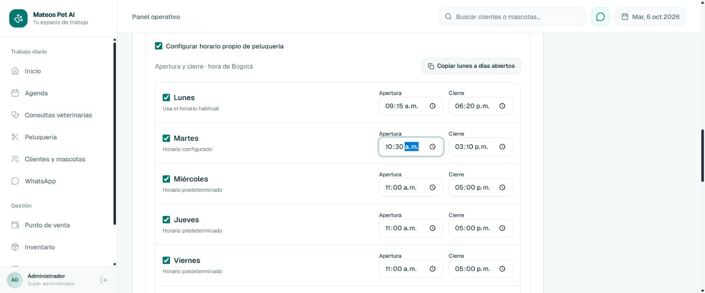
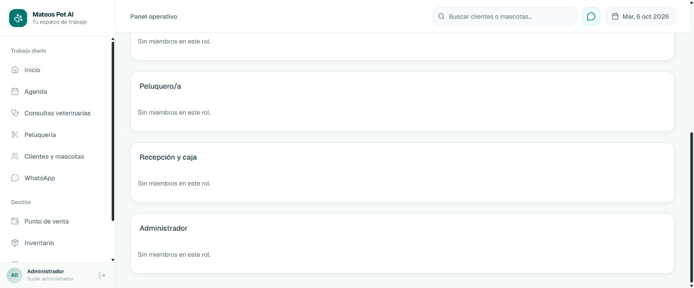

# Horarios con minutos y navegación a Equipo

Fecha: 2026-10-06. Corrección solicitada por el responsable a partir de las capturas de Administración.

## Resultado

- Apertura y cierre aceptan horas y minutos: 09:15, 10:20, 10:30 y 15:10, tanto en el horario habitual como en los horarios propios y las fechas especiales.
- La disponibilidad conserva los minutos al leer HH:mm. Las sugerencias parten de la apertura configurada y el turno debe caber antes del cierre.
- Crear una cita manual ya permite 10:30 en peluquería cuando su disponibilidad lo autoriza. La construcción de la fecha UTC admite cualquier minuto válido y rechaza fracciones de segundo.
- Peluquería conserva sus turnos consecutivos de una hora desde la apertura. La capacidad vigente, la prioridad de fechas especiales, los festivos, Bogotá y el aislamiento por establecimiento se mantienen.
- Los textos de las sugerencias, el formulario de nuevas citas, los recordatorios y la revisión de citas afectadas conservan los minutos.
- **Ver equipo y accesos** selecciona realmente esa sección. Si hay cambios pendientes, permite continuar editando o descartarlos antes de salir.

Diseño previo y límites de la corrección: `docs/history/designs/ADMINISTRATION_MINUTE_PRECISION_FIX_20261006.md`.
Este informe sustituye la limitación inicial a horas completas del informe anterior de Horarios.

## Evidencia real

### Pruebas automatizadas

Jest, diez suites de disponibilidad, fecha/hora conversacional, excepciones, recordatorios, perfil del negocio, creación manual y wiring de API pública:

```text
Test Suites: 10 passed, 10 total
Tests:       148 passed, 148 total
Time:        5.106 s
EXIT 0
```

Prueba local `scripts/business-hours-postgres.test.cjs`, contra PostgreSQL real y rutas Express reales, con establecimientos temporales:

```text
PASS: PostgreSQL conserva 10:20/10:30; disponibilidad y construcción real de citas conservan sus minutos.
PASS: guardar/leer horarios, límites, herencia por área, festivos, preview, fecha única/rango, edición, eliminación, aislamiento e historial en PostgreSQL real.
tests 2
pass 2
fail 0
EXIT 0
```

```text
ESLint completo EXIT 0
Compiled successfully in 6.0s
Finished TypeScript in 4.7s
Generating static pages (29/29)
Build EXIT 0
git diff --check EXIT 0
```

El build se ejecutó con NEXT_VERIFY_BUILD=1 y --webpack, separado del servidor de desarrollo del usuario.
La búsqueda contra 819 archivos de código del repositorio encontró cero restricciones antiguas de horas completas, inputs con paso de 3600 o validación de citas limitada a medias horas. Google Calendar ya conserva sus minutos mediante su lectura independiente de hora y minuto.

### Recorrido en Chrome

Interfaz de producción local aislada, puerto 3121, conectada exclusivamente a un establecimiento temporal:

1. Introducir 09:15–18:20 en el horario habitual y 10:30–15:10 en peluquería.
2. Pulsar Equipo con cambios pendientes: aparece Cambios sin guardar. Seguir editando conserva los valores.
3. Primer guardado devuelve un 503 simulado: permanece el borrador y aparece un error claro. Segundo guardado funciona.
4. Pulsar Ver equipo y accesos: pestaña seleccionada y formulario del equipo cargado.
5. Volver a Horarios: conserva los minutos y muestra No hay cambios pendientes.
6. Crear apertura especial el 25/12/2026, 10:30–15:10; revisar citas afectadas y guardar. Aparece Abierto 10:30–15:10 en la lista.
7. La lectura directa de PostgreSQL confirma los horarios introducidos desde la interfaz.

```text
PASS: horario habitual, horario propio de peluquería, herencia de días y fecha especial guardados desde la interfaz en PostgreSQL.
PASS: disposable tenant removed; existing business data unchanged.
PASS: no queda ningún establecimiento temporal de esta comprobación.
EXIT 0
```





## Estado y siguiente apartado

Horarios y disponibilidad queda listo para continuar. No propongo más cambios esenciales en este apartado; sigue **Equipo y accesos**.
Los cambios están locales, sin commit, push ni despliegue en este pedido. No se enviaron mensajes, ni se alteraron horarios o citas reales durante las comprobaciones. Los servidores temporales y sus datos se retiraron.
