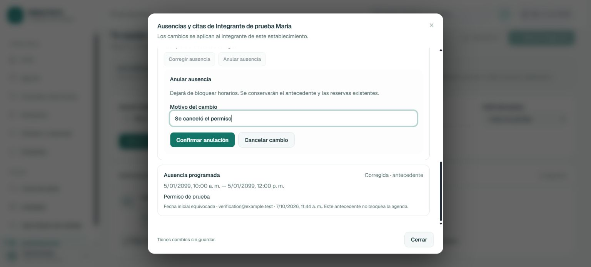
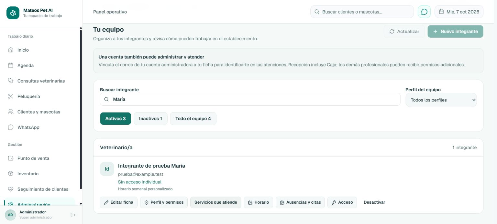
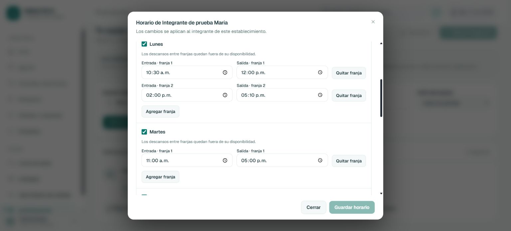
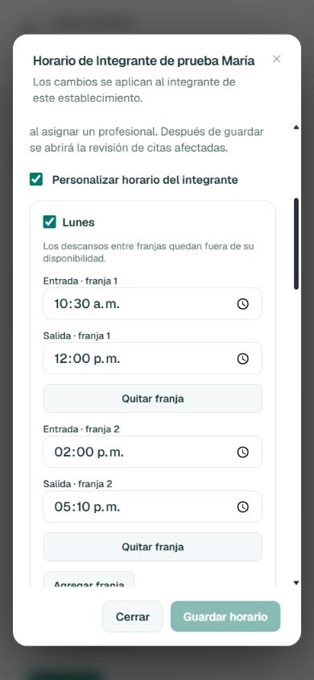

# Equipo y accesos: ajustes finales

**Estado:** los tres ajustes aceptados están implementados y comprobados localmente. Fecha: 7 de octubre de 2026. La publicación en GitHub/VPS queda pendiente.

## Cambios disponibles

1. **Corregir o anular ausencias.** En Administración → Equipo y accesos → Ausencias y citas aparecen ambas acciones. Exigen motivo; conservan el rango y motivo originales, el autor y la fecha del cambio. Una corrección crea un reemplazo vinculado; una anulación deja de bloquear horarios. El panel distingue Vigente, Anulada y Corregida · antecedente. Las reservas existentes se conservan y se vuelve a consultar cuáles necesitan revisión.
2. **Servicios que atiende.** Disponible en las fichas de veterinarios, peluqueros y administradores. Permite usar todos los servicios compatibles con el perfil o limitar a una selección. Una selección vacía impide nuevas asignaciones. Los cambios muestran las citas futuras afectadas y conservan las capacidades revocadas en el historial. Esta configuración no cambia permisos de acceso. Recepción continúa con sus permisos actuales.
3. **Horario con varias franjas.** Cada día admite hasta ocho ventanas con horas y minutos. Se pueden agregar y quitar franjas; se rechazan cruces y rangos inválidos. Los descansos quedan fuera de la disponibilidad y todas las franjas se conservan al guardar y reabrir. Las ausencias no se eliminan al editar el horario.

Diseño aprobado documentado en [ADR 018](../decisions/018-equipo-ausencias-capacidades-franjas.md). Se reutilizan los casos de uso de capacidades y disponibilidad, la revisión de citas y el lock de asignación del ADR 011.

## Comprobaciones y evidencia real

### Backend y perfiles

Comando ejecutado desde backend:

```text
node node_modules/jest/bin/jest.js --runInBand --silent --testPathPatterns='contexts/staff|staff-tenant-wiring|veterinary-access|business-access|grooming-access|dashboard-manual-appointment|public-api.*wiring'

Test Suites: 25 passed, 25 total
Tests:       193 passed, 193 total
Exit code: 0
```

Incluye contexto Staff, transporte de tenant, creación manual de citas, acceso por perfil/áreas y wiring de la API pública. La comprobación adicional con Express y PostgreSQL real confirmó que administrador puede realizar los comandos y que recepción, veterinario y peluquero reciben 403 en cambios de servicios y ausencias, y en consultas administrativas de disponibilidad. Recepción conserva acceso a la búsqueda de profesionales disponibles. Se comprobaron respuestas del servidor; no se crearon cuentas de ingreso para personas ni se simularon inicios de sesión reales de empleados.

### PostgreSQL local

```text
node --test scripts/staff-agenda-postgres.test.cjs scripts/team-administration-postgres.test.cjs

PASS ADR 018: corrección y anulación auditadas, autor autenticado,
concurrencia 200/409, historial intacto, franjas con descanso,
servicios seleccionados/vacíos/por perfil, capacidades revocadas
conservadas, resolver canónico y tres perfiles sin permisos administrativos.
PASS: todas las filas de prueba eliminadas; datos del negocio conservados.
PASS: establecimientos e integrantes temporales eliminados.
ℹ tests 3
ℹ pass 3
ℹ fail 0
Exit code: 0
```

Además: servicio de otro establecimiento, servicio retirado no seleccionado e incompatibilidad de área rechazados sin persistir capacidades; dos correcciones simultáneas producen un éxito y un conflicto, con un solo reemplazo; el cuerpo HTTP no puede falsificar el autor del cambio. La lectura canónica devuelve las dos franjas y no ofrece citas que atraviesen el descanso.

Migración aditiva aplicada exclusivamente a `mateos_dev` en localhost:

```text
node node_modules/prisma/build/index.js migrate deploy
Applying migration 20261007170000_staff_absence_correction_service_scope
All migrations have been successfully applied.
Exit code: 0

node node_modules/prisma/build/index.js generate
Generated Prisma Client (v7.10.0)
Exit code: 0

node node_modules/prisma/build/index.js validate
The schema at prisma\schema.prisma is valid
Exit code: 0
```

### Frontend

```text
node node_modules/eslint/bin/eslint.js .
Exit code: 0, sin errores ni advertencias.

NEXT_VERIFY_BUILD=1 node node_modules/next/dist/bin/next build
✓ Compiled successfully in 1882ms
Running TypeScript ...
Finished TypeScript in 4.3s ...
✓ Generating static pages using 11 workers (29/29) in 544ms
Exit code: 0
```

Se comprobó sintaxis de 32 archivos JavaScript cambiados/nuevos mediante `node --check`. `git diff --check` terminó con código 0; Git solo mostró avisos de normalización LF/CRLF.

### Recorrido visual

Navegador Chrome, frontend de producción y API reales en puertos temporales 3121/3120, establecimiento desechable:

- Guardar lunes 10:30–12:00 y 14:00–17:10; reabrir y comprobar ambas franjas.
- Registrar ausencia 10:00–12:00: una cita queda por revisar.
- Corregir a 14:00–15:00: el original se conserva y la cita deja de estar afectada.
- Anular el reemplazo: quedan visibles ambos antecedentes, sin bloqueo.
- Seleccionar cero servicios: la cita aparece por revisar porque el profesional no tiene habilitado el servicio.
- Seleccionar de nuevo Consulta: guardar y comprobar cero citas por revisar.
- Agregar y quitar una tercera franja sin alterar las dos guardadas.
- Pantalla móvil 390×844: documento de 390 px, diálogo de 358,4 px e inputs de 272,8 px; controles apilados sin desbordamiento horizontal y pie de acciones visible.

Las pruebas usaron únicamente integrantes, mascota y citas ficticios. No enviaron WhatsApp ni crearon eventos en Google Calendar. Se cerraron la pestaña y los procesos temporales y se restauró el tamaño del navegador.

```text
node scripts/verify-administration-local.cjs cleanup
PASS: disposable tenant removed; existing business data unchanged.
Exit code: 0

node scripts/verify-administration-local.cjs cleanup-check
PASS: no queda ningún establecimiento temporal de esta comprobación.
Exit code: 0
```

## Capturas de la comprobación

### Ausencias conservadas tras corregir y anular



### Selección explícita de servicios

Captura del formulario con Consulta seleccionada; el guardado posterior confirmó cero citas afectadas.



### Dos franjas de atención conservadas





## Publicación

Estos ajustes y los cambios anteriores de Administración están locales. No se realizó commit, push ni despliegue en esta tarea. Antes de publicarlos corresponde revisar el conjunto, evaluar el bump de versión y aplicar las migraciones pendientes de Administración en la VPS, incluida la de ADR 018. La comprobación visual utilizó puertos de prueba; los servidores personales del usuario no se reiniciaron.

Con estas comprobaciones, los tres ajustes solicitados quedan resueltos localmente. No se propone ampliar Administración con más pantallas en este cierre.
