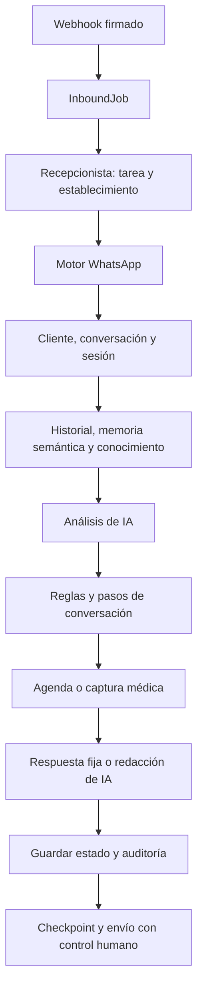

# Auditoría integral del asistente virtual — 10 de octubre de 2026

**Versión inspeccionada:** 2.45.2, commit `ac6709b`. **Estado de esta evidencia:** auditoría de la base publicada. La implementación local posterior y los pendientes están en [informe de ejecución](VIRTUAL_ASSISTANT_IMPROVEMENTS_EXECUTION_20261010.md); no está desplegada. **Decisión para beta:** continuar validación interna supervisada; paso 8 abierto.

## 1. Resumen para el responsable del proyecto

El asistente tiene infraestructura útil, pero demasiadas responsabilidades se ejecutan dentro del mismo recorrido. El problema principal es quién decide lo que ocurre con cada mensaje: unas veces decide una coincidencia de texto, otras el análisis de IA, otras un paso guardado y otras datos del historial. Las prioridades y las fuentes de verdad no siempre coinciden.

**Recomiendo simplificarlo y corregirlo por etapas.** Primero proteger confirmación, cancelación y reprogramación. Después organizar un único flujo que conserve la mascota, el servicio y la propuesta activa. Finalmente reducir llamadas innecesarias, retirar lógica duplicada y separar funciones clínicas del trabajo de recepción.

El hallazgo más urgente: el código acepta **«No confirmo»** como confirmación. También acepta **«Necesito saber cuánto cuesta»**, **«No estoy de acuerdo»** y **«No sé si puedo»**. Se reprodujo con la función real, sin crear citas. Esto debe corregirse antes de ampliar las pruebas.

### Qué mejorar

- Entender aceptación, rechazo, dudas y correcciones antes de ejecutar una operación.
- Identificar la mascota y la cita exactas; conservar una reserva pendiente al responder preguntas.
- Guardar el estado de forma ordenada y recuperable; resolver coherentemente el control humano.
- Responder disponibilidad por el día y servicio solicitados, con explicaciones reales.
- Verificar los datos de recogida y distinguir una confirmación guardada de una propuesta.
- Completar los casos de mensajes agrupados, errores de envío y reinicio.

### Qué reorganizar

- Un coordinador conversacional para decidir la siguiente acción y el dato que falta.
- Una fuente de verdad por dato: identidad autenticada, registros del negocio, borrador vigente y estado de control humano.
- Adaptadores pequeños para texto, audio e imagen; consultas y comandos de agenda separados de la redacción.
- Memoria reciente para el diálogo y búsqueda semántica solo cuando aporte información.
- Un contrato validado para la salida de IA y una política común de tiempos/reintentos.

### Qué retirar o sustituir

- Confirmación por subcadenas y cancelación automática de la última cita del cliente.
- El simulador que reproduce otro motor y puede anunciar una cita sin guardarla.
- Generar dos veces el vector del mismo mensaje para las dos búsquedas.
- La indexación indiscriminada de mensajes triviales y la redacción con IA de respuestas operativas que ya son suficientes.
- La instrucción de hacerse pasar por una persona real.
- El helper de siguiente turno sin consumidores y los campos de conversación sin productores reales.
- Como decisión de alcance, retirar del recorrido automático de recepción el análisis clínico de imágenes y la escritura de notas médicas sin confirmar mascota y contenido.

Las retiradas propuestas que cambian capacidades activas necesitan una decisión funcional. Esta auditoría no elimina código, registros, historiales ni integraciones.

## 2. Alcance y método

Se revisaron el webhook y su firma, normalización y lotes, cola durable, recuperación y envío; el adaptador de Recepcionista IA y su auditoría; el motor conversacional, análisis/redacción, sesión, historial y búsquedas; identificación de cliente y mascota; disponibilidad y persistencia de citas; gestión de citas; control humano; audio, imagen y captura médica; recordatorios vinculados al diálogo y simulador de desarrollo. Se rastrearon consumidores de los candidatos a limpieza por el repositorio ejecutable completo.

La revisión usa los principios de `PLAN_MAESTRO.md`, el cierre de Fase 1, el modelo de dominio y la regla de ejecución de Fase 2. El dueño puede tener varias mascotas; la cita identifica mascota, servicio y horario; el establecimiento sigue siendo la unidad de aislamiento. Las reglas del negocio deben ser invocables desde otros canales. Los cambios al motor necesitan diseño y reconciliación, siguiendo el criterio de Fase 8; no se propone iniciar una fase nueva ni otro empleado digital.

Se aplicó la guía `engineering:code-review`. La evidencia combina lectura de código, la prueba real Matías/Akiles ya registrada y reproducciones aisladas con dependencias simuladas. Las reproducciones de esta auditoría no envían WhatsApp, no usan OpenAI real y no escriben en la VPS.

**Límites:** no es una certificación exhaustiva de todas las conversaciones posibles, una prueba de carga ni una auditoría completa del frontend o del dominio clínico. Los errores observados en producción se distinguen de riesgos de código. No se midió aún el coste monetario ni la latencia real por etapa; no se prometen porcentajes de ahorro.

## 3. Recorrido actual y complejidad



Hay caminos anticipados para audio, imágenes, documentos y confirmación veterinaria. Peluquería persiste mediante otra rama, después de generar la respuesta. El dibujo resume el recorrido normal; no significa que todos los mensajes atraviesen cada etapa.

| Componente | Tamaño inspeccionado | Responsabilidad actual |
| --- | ---: | --- |
| `whatsapp.service.js` | 978 líneas | Parsing, cliente, adjuntos, sesión, búsquedas, IA, confirmación y persistencia de reservas. |
| `conversation.service.js` | 735 líneas | Decisión de diálogo, agenda, consultas, gestión, captura médica y redacción. |
| `scheduling.service.js` | 603 líneas | Interpretación de fechas/horas, disponibilidad y mensajes. |
| `openai.service.js` | 320 líneas | Dos prompts y dos recorridos de llamadas. |
| `memory.service.js` | 212 líneas | Caché y persistencia de sesión en segundo plano. |
| `conversation-persistence.service.js` | 211 líneas | Conversación, mensajes, indexación e intención/paso. |

El tamaño orienta la separación de responsabilidades; no demuestra por sí solo que un archivo sea innecesario.

En un mensaje de texto normal pueden intervenir: un embedding de almacenamiento, otro de búsqueda personal, otro de búsqueda del negocio, análisis de intención, extracción médica y redacción. Son **hasta seis solicitudes al proveedor**, dependiendo de las ramas, algunas en segundo plano. Audio e imagen tienen llamadas adicionales propias. Eliminar búsquedas/redacción innecesarias no requiere cambiar de modelo ni contratar servicios.

## 4. Hallazgos priorizados

Prioridad **P0:** puede ejecutar una operación equivocada sobre una cita. **P1:** afecta coherencia, aislamiento, recuperación o entrega. **P2:** simplificación, rendimiento y mantenimiento. La prioridad no significa que todos los riesgos ya hayan ocurrido en producción.

### 4.1 Operaciones sobre citas

| ID | Prioridad / evidencia | Hallazgo y cambio recomendado |
| --- | --- | --- |
| AV01 | P0 · reproducción aislada | `conversation.service.js:61–64` usa `includes` con «si», «confirmo», «de acuerdo», etc. Acepta negaciones y palabras como «necesito». La rama veterinaria de `whatsapp.service.js:493` puede persistir la cita si el turno anterior es válido. Sustituir por aceptación inequívoca de la propuesta vigente; las negaciones y dudas no ejecutan comandos. |
| AV02 | P0 · lectura de código | `appointment.service.js:229–252` cancela por cliente y fecha descendente; no identifica mascota/servicio solicitado. `conversation.service.js:159–172` cancela antes de pedir el nuevo turno. Seleccionar cita exacta con identidad autorizada y conservar la original hasta validar/confirmar el reemplazo. No se canceló ninguna cita durante la auditoría. |
| AV03 | P1 · incidente real | Gestión de citas se evalúa antes que la reserva activa (`conversation.service.js:348–350`). La consulta devuelve `step=null`; el resto del borrador permanece. «¿Para hoy ya no hay?» sacó al flujo de peluquería de Matías. Arbitrar intención con el objetivo vigente y conservar el borrador en consultas informativas. |
| AV04 | P1 · reproducción aislada | La confirmación de peluquería (`conversation.service.js:415–421`) acepta «Sí, pero para Matías» mientras la sesión selecciona Akiles, y avanza a recogida sin resolver el cambio. La rama veterinaria tiene una protección distinta. Aplicar la misma validación de identidad y propuesta en ambos servicios. |
| AV05 | P1 · reproducción aislada | En dirección (`conversation.service.js:456–469`) cualquier texto de al menos cuatro caracteres puede desencadenar creación. «No sé todavía» produce `createGroomingAppointment=true`. Separar duda/corrección de dirección; mostrar dirección y datos definitivos antes de reservar cuando corresponda. |
| AV06 | P1 · incidente y reproducción de disponibilidad | El turno previo de peluquería libre pero no reservable por anticipación bloquea todo el resto del día (`availability-db.service.js:202–207`). Aclarar la regla: secuencia entre turnos aún reservables, preservando secuencia futura, duración, cierres y margen. Esta aclaración funcional sigue pendiente de aceptar/documentar. |
| AV07 | P1 · lectura e incidente | La petición de solo día no limita la búsqueda (`conversation.service.js:570–593`); una aclaración repite la próxima fecha global. Consultar primero el día pedido para el servicio activo; explicar cierre/sin cupo y ofrecer otra opción. |
| AV08 | P1 · lectura e incidente | La consulta de citas imprime servicio/fecha/hora, omitiendo mascota (`appointment.service.js:188`). La protección del tipo de mascota permite datos del análisis al mencionar un nombre nuevo (`booking-turn.service.js:64–79`). Mostrar mascota en consultas y obtener especie del registro seleccionado o de una respuesta explícita. |

Las causas y la transcripción Matías/Akiles se conservan en [la auditoría del incidente](WHATSAPP_BOOKING_CONTEXT_AUDIT_20261010.md). La cita veterinaria de Akiles usa otra capacidad y no bloquea peluquería. Matías todavía era un borrador; no se encontró una cita ni una mascota persistida para él en aquella inspección.

### 4.2 Estado, identidad y control humano

| ID | Prioridad / evidencia | Hallazgo y cambio recomendado |
| --- | --- | --- |
| AV09 | P1 · lectura + simulación de escritura | `memory.service.js:157–176` inicia persistencia sin esperarla. `syncConversationState` escribe intención/paso por otra vía y también absorbe errores. Dos actualizaciones pueden terminar en orden inverso; un reinicio puede recuperar datos anteriores. Unificar la escritura de estado, esperar su confirmación y definir cómo se recupera un fallo antes de dar el turno por completado. |
| AV10 | P1 · reproducción aislada | Caché y contexto usan solo teléfono (`memory.service.js:91–121`). Al hidratar conversación B después de A con el mismo teléfono, devuelve la mascota de A aunque cambie conversación/usuario. Usar identidad de establecimiento/cliente/conversación para caché y locks; invalidar al cambiar contexto. Es un riesgo de la capacidad multiestablecimiento ya existente, no una mezcla observada entre tus dos teléfonos. |
| AV11 | P1 · reproducción aislada | La resolución de escalación cambia `Conversation.status`, pero el wrapper de Recepcionista sigue leyendo `requires_human_attention` persistente (`process-incoming-message.usecase.js:57–66`). Estado activo + bandera antigua vuelve a solicitar escalación. Usar el estado canónico y una señal de escalamiento nueva del turno; retirar la bandera persistida como segunda autoridad. El booleano derivado que necesita el dashboard puede mantenerse. |
| AV12 | P1 · reproducción aislada | `openai.service.js:162–163` solo hace `JSON.parse`; admite intención desconocida, nombre como objeto y una clave `step` no permitida. `mergeSessionData` acepta todas las claves no vacías. Validar estructura, tipos, enums y campos permitidos antes de mezclar; el LLM no suministra pasos, identidad autorizada ni prueba de confirmación. |
| AV13 | P1 · lectura | Si análisis y sesión no aportan datos utilizables, vuelve a un saludo genérico (`conversation.service.js:331–332`, `647–650`). El usuario que corrige un error recibe otro inicio. Dar una aclaración ligada al objetivo pendiente, conservar datos ya confirmados y ofrecer atención humana cuando no se pueda continuar. |

La hidratación y la caché también necesitan un criterio explícito de caducidad y limpieza. Actualmente los objetos de sesión/contexto permanecen en memoria hasta una llamada de limpieza; no se observó una fuga de RAM en esta auditoría.

### 4.3 Recepción, entrega y recuperación

| ID | Prioridad / evidencia | Hallazgo y cambio recomendado |
| --- | --- | --- |
| AV14 | P1 · reproducción aislada | El controller usa el primer mensaje (`webhook.controller.js:36–39`). En un lote con ubicación no soportada seguida de texto válido, el parser inicial devuelve `null` y responde 200 sin encolar; el parser completo encuentra un mensaje válido. Encolar/deduplicar por mensaje soportado y establecimiento; no descartar todo el lote por su primer elemento. |
| AV15 | P1 · reproducción aislada | `prepareReplies` exige que el último resultado sea procesado y tenga remitente (`inbound-message.job.js:25–27`). Si el último es duplicado, descarta `additionalReplies` válidas anteriores. Evaluar cada respuesta por separado y conservar sus checkpoints. No se observó ese lote en tu prueba real; se reprodujo el límite con el código real. |
| AV16 | P1 · lectura | En `send-message.usecase.js:79–97` el envío externo ocurre antes de guardar el mensaje y publicar el evento. Si uno de esos pasos falla después de aceptación externa, el reintento de `sendOneReply` puede repetir el envío. El provider reduce la respuesta a booleano y pierde el `wamid` para este contrato; el parser de entrada no procesa `statuses`. Diseñar trazabilidad por intento y distinguir aceptado/enviado/entregado/fallido; ante resultado incierto evitar reenvío ciego. La cola ya detiene crashes inciertos con `needs_review`: preservar esa protección. |
| AV17 | P2 · lectura | El drenaje global espera un job tras otro (`inbound-message.job.js:121`), con búsquedas y llamadas externas dentro. Un turno lento retrasa a otros clientes. Primero reducir llamadas y fijar presupuesto por turno; medir carga. Evaluar concurrencia limitada solo después de resolver claves de estado/locks y recuperación. No agregar múltiples instancias ni otra cola por esta auditoría. |

El nombre `verifyWebhookSignature` del servicio verifica el desafío GET; **la firma POST sí se valida** en `validateWebhookSignature.js` mediante HMAC y comparación segura, y la ruta la aplica. No se reporta una ausencia de protección que el código ya tiene. Puede aclararse el nombre del helper para evitar confusión.

### 4.4 IA, memoria y funciones adicionales

| ID | Prioridad / evidencia | Hallazgo y cambio recomendado |
| --- | --- | --- |
| AV18 | P2 · lectura | Cada búsqueda personal y del negocio vuelve a generar el vector de la misma consulta; además se indexa cada mensaje del cliente (`conversation-persistence.service.js:122–137`). Generar una vez cuando se necesite y reutilizarlo; decidir qué mensajes contienen información duradera. Evitar búsqueda/indexación de saludos, aceptación y agradecimientos cuando no aporten contexto. |
| AV19 | P2 · lectura | Las búsquedas devuelven los cinco vecinos sin umbral de relevancia; la memoria contiene mensajes crudos, no hechos validados. Ambos contextos se añaden al prompt de sistema como memoria (`openai.service.js:79–89`). Separar procedencia y relevancia, tratar texto recuperado como datos y dar prioridad a la selección explícita y registros actuales. La inserción de datos en instrucciones aumenta el riesgo de interferencia; no se ejecutó un ataque contra producción. |
| AV20 | P2 · lectura | `getConversationMessages` carga todo el historial (`conversation-persistence.service.js:155–158`) y luego limita a 20 mensajes/6.000 caracteres. Limitar también la consulta y ordenar el tramo reciente. Conservar datos históricos en la BD; no borrarlos para reducir contexto. |
| AV21 | P1 · lectura | La captura médica se ejecuta fuera del wizard si queda una mascota en sesión, sin exigir intención médica (`conversation.service.js:669–679`, `medical-auto-capture.service.js:35–49`). Las imágenes usan la mascota de sesión y guardan una nota generada por IA (`whatsapp.service.js:370–435`). Exigir mascota explícita y procedencia del contenido; recomendar sacar la escritura clínica automática del trabajo habitual de recepción hasta decidir y validar su alcance. |
| AV22 | P1 · lectura | Al recibir imagen sin mascota, pregunta el nombre pero no conserva una referencia pendiente del adjunto para retomarlo (`whatsapp.service.js:373–388`; campos de sesión). El siguiente texto no vuelve a procesar esa imagen. Si se conserva esta capacidad, modelar una solicitud pendiente y retomarla con identidad validada; alternativamente avisar qué debe reenviar el usuario. |
| AV23 | P1 · lectura | El prompt ordena afirmar que Lina es persona real y decir que el cliente ya está hablando con ella al pedir una persona (`openai.service.js:180`, `201`), mientras el flujo también escala con Lina. Retirar esa instrucción y distinguir asistente y equipo humano con lenguaje transparente. Además, marca/servicios en prompts y respuestas son fijos; la respuesta informativa enumera laboratorio, cirugía, etc. sin consultar el catálogo. Usar configuración y servicios activos del establecimiento, sin inventar oferta o precios. |
| AV24 | P2 · lectura y búsqueda de consumidores | El simulador `/api/test/analyze` conserva otro flujo y anuncia confirmación sin persistencia (`test.routes.js:79–94`); está restringido a desarrollo. `resolveGroomingNextSlotMessage` solo aparece en definición/export y no recibe tenant. `grooming_breed`/`grooming_size` solo aparecen como lecturas en el motor. Sustituir simulador por pruebas del recorrido real; retirar helper sin consumidores y lecturas huérfanas tras verificar contratos. |

Audio, imagen, embeddings y análisis tienen clientes OpenAI/configuración separadas. El analizador principal declara dos reintentos; el resto depende de su configuración. Faltan presupuestos explícitos y homogéneos por operación/turno; el envío de texto por Axios tampoco fija un timeout en esa llamada. Revisar límites, cancelación, reintentos y mensajes de recuperación conjuntamente. No se asume que el SDK carezca de límites predeterminados.

## 5. Qué conservar

| Pieza | Motivo |
| --- | --- |
| Cola `InboundJob`, leases, checkpoints, recuperación e incertidumbre `needs_review` | Evitan perder mensajes/repetir operaciones a ciegas cuando el proceso se interrumpe. |
| Firma del webhook y deduplicación por evento | Protegen recepción auténtica e idempotencia. Ajustar lotes, no retirar las protecciones. |
| Aislamiento por establecimiento, propiedad del cliente y mascota | Son requisitos del producto existente. |
| Horarios por servicio, festivos, excepciones y margen de anticipación | Fuente de disponibilidad real; corregir la contradicción de secuencia sin saltarse cierres. |
| Verificación transaccional de conflictos y restricción de reserva | Protegen frente a confirmaciones simultáneas; el cliente necesita además una respuesta coherente al perder el turno. |
| Historial `Message`, auditoría de decisiones y control humano versionado | Permiten explicar fallos y operar con el equipo. Reducir duplicación/ruido conservando los hechos. |
| Envío central por Comunicación y guard de control humano | Evita mensajes del asistente preparados antes de que el equipo tome el chat. |
| `booking-message.service.js` y resúmenes estructurados | Ya centralizan datos del mensaje final; extender el mismo criterio a propuestas y gestión. |
| Transcripción de audio y respuesta de respaldo | Puede aportar al canal; mantener aislada y con límites. |
| PostgreSQL en Docker/VPS y Prisma | Almacenamiento y acceso a datos necesarios; no son duplicaciones del motor. |

Se comprobó mediante búsqueda que la llamada ejecutable a `sendWhatsAppMessage` sigue en el proveedor de Comunicación. No se propone abrir una segunda vía de envío.

## 6. Limpieza concreta y alcance

| Elemento | Acción propuesta | Condición para retirarlo |
| --- | --- | --- |
| `includes` en confirmación | Sustituir ahora por aceptación explícita de una propuesta vigente. | Regresiones negativas, dudas, cambios y confirmación positiva aprobadas. |
| Cancelar «última cita activa» | Retirar esa selección implícita del asistente. | Cita objetivo resuelta por ID autorizado, con aclaración ante varias. |
| Bandera persistente de escalamiento como autoridad | Retirar del arbitraje; conservar una señal nueva del turno y estado canónico. | Pausar, resolver, responder y volver a pedir humano funcionan sin bucles. |
| `resolveGroomingNextSlotMessage` | Candidato directo a eliminación. | Búsqueda actual: dos referencias, definición y export; repetir búsqueda en todo el repositorio al implementar. |
| Flujo duplicado en `test.routes.js` | Sustituir o retirar el recorrido duplicado. | Simulación del pipeline real, sin envío/operación externa y sin falsos mensajes de éxito. |
| Texto genérico de éxito de `getConfirmationReply` | Unificar con resumen confirmado; no borrar de golpe la función. | Hoy el motor aún usa paso/patch y el simulador usa su texto. Migrar consumidores primero. |
| `grooming_breed`/`grooming_size` en sesión | Retirar lecturas sin productor o definir formalmente origen si son necesarios. | No eliminar campos de dominio ni captura del dashboard por confundirlos con estas claves del motor. |
| Embedding duplicado de consulta | Reutilizar uno o no buscar cuando el turno no lo necesita. | Medir llamadas y conservar relevancia/aislamiento. |
| Indexación de todo mensaje y redacción cosmética de cada turno | Retirar de respuestas operativas determinísticas y mensajes triviales. | Comparar respuesta, latencia, llamadas y recuperación con la versión base. |
| Clínica automática dentro de recepción | Propuesta de reducción de alcance; aislar y suspender escritura automática hasta diseño/validación. | Decisión funcional explícita, identidad de mascota y confirmación de contenido; conservar historial y funciones clínicas ya existentes. |
| Configuración OpenAI repetida | Centralizar configuración común, manteniendo operaciones separadas. | No mezclar prompts ni romper transcripción/imágenes. |
| Logs completos de teléfono, sesión, mensaje, transcripción y respuesta | Reducir/máscarar en operación; mantener IDs y motivos útiles. | Poder rastrear el incidente sin duplicar innecesariamente contenido del cliente en logs. |

No se clasifica una integración activa como «inútil» solo por ser externa. La dependencia de IA y el canal WhatsApp forman parte del asistente; el ahorro inicial sale de usarlos con criterio. La búsqueda semántica y pgvector tienen consumidores actuales: no borrarlos sin medir el valor y decidir su alcance.

`getPetEmoji` también tiene consumidores reales, tanto en el motor para historial como en frontend: **no es código muerto**. Se descarta su eliminación. `parseIncomingMessage` tiene consumidores actuales; debe reconciliarse con lotes antes de retirarlo. La revisión de consumidores evita una limpieza indiscriminada.

## 7. Organización objetivo, sin reescritura masiva

| Responsabilidad | Fuente de verdad / límite |
| --- | --- |
| Identidad | Tenant y usuario resueltos/autenticados; no los proporciona la IA. |
| Estado de diálogo | Un borrador coherente y persistido: objetivo, mascota, servicio, restricciones, propuesta vigente y dato pendiente. |
| Control humano | `Conversation.status`, asignación y versión; una petición del turno genera transición, una bandera antigua no la repite. |
| Interpretación | Extraer intención/datos con contrato validado. Distinguir afirmación, negación, duda, pregunta y corrección. |
| Consultas | Citas/mascotas/catalogo/disponibilidad existentes; responder sin mutar la reserva pendiente. |
| Comandos | Confirmar, cancelar o reprogramar una operación identificada y autorizada. Validación, conflicto y persistencia pertenecen a aplicación/dominio. |
| Mensaje | Resultado verificado transformado a WhatsApp; IA opcional para preguntas abiertas, sin inventar éxito ni cambiar datos. |
| Contexto | Tramo reciente y hechos relevantes con procedencia; identidad/estado actual prevalecen sobre memoria antigua. |
| Canal | Recibir adjuntos, normalizar, encolar, entregar y registrar aceptación/estado sin decidir reglas de agenda. |

Separar responsabilidades en torno al código existente. Empezar por funciones pequeñas con contratos explícitos y tests del incidente. No instalar un framework de agentes, agregar una base externa ni construir un segundo coordinador digital. Si se necesita un caso de uso atómico de reprogramación o nuevos datos persistentes, pasar por definición funcional, casos de uso, arquitectura, persistencia y esquema antes de implementarlo.

Una tabla de decisiones para estos casos resulta útil; un wizard rígido que prohíba preguntas/correcciones sería contrario al carácter interrumpible ya documentado. La sesión puede mantener un borrador, pero una consulta no debe destruirlo ni convertirse automáticamente en un comando.

## 8. Plan de ejecución recomendado

### Bloque A — decisiones seguras sobre reservas

- [ ] AV01: aceptación explícita; rechazos, dudas y preguntas no confirman.
- [ ] AV02: seleccionar cita; conservar original al reprogramar.
- [ ] AV04/AV05: misma identidad/propuesta en ambos servicios; dirección pendiente distinta de dirección confirmada.

**Cierre:** ninguna cita creada/cancelada por los mensajes negativos o ambiguos; solo cambia la cita explícitamente seleccionada; pruebas de fallos y conflictos conservan el resultado real.

### Bloque B — contexto y estado

- [ ] AV03/AV07/AV08/AV13: conservar Matías/peluquería ante preguntas, aclaraciones y fallo de IA; consultas muestran mascota.
- [ ] AV09/AV10/AV11: escritura ordenada, identidad de caché, devolución de control humano sin bandera antigua.
- [ ] AV12: validar salida de IA y campos que pueden entrar al borrador.

**Cierre:** repetir la conversación real, cambiar mascota/servicio sin herencias, reiniciar backend en una conversación pendiente y verificar continuidad; mismo teléfono en dos establecimientos mantiene separación; resolver humano permite respuesta automática normal.

### Bloque C — disponibilidad y recuperación

- [ ] AV06: aprobar/documentar la precisión de secuencia para huecos no reservables.
- [ ] AV14/AV15: todos los mensajes soportados del lote y sus respuestas se conservan, con deduplicación propia.
- [ ] AV16: resultado incierto de envío no dispara repetición ciega; distinguir aceptación de entrega.

**Cierre:** las reglas de agenda anteriores siguen pasando; conflicto simultáneo por mismo servicio/turno produce una sola cita; fallo posterior al envío y reinicio no generan reservas o respuestas duplicadas por reintento automático.

### Bloque D — simplificación medida

- [ ] AV18/AV19/AV20: limitar historial y recuperar/indexar solo información útil, con relevancia y procedencia.
- [ ] AV21/AV22/AV23: definir límite clínico y adjuntos; retirar identidad falsa y oferta fija de servicios.
- [ ] AV24: retirar helper huérfano y sustituir simulador duplicado; centralizar configuración y mensajes operativos.
- [ ] AV17: medir dos y varios remitentes antes de decidir concurrencia limitada.

**Cierre:** mismo resultado funcional con menos llamadas innecesarias; medir llamadas por tipo de mensaje, latencia mediana/percentil 95, cola y errores. Cero borrado de datos del negocio por esta limpieza.

Cada bloque debe tener diseño acotado, pruebas, revisión, documentación y evaluación de versión antes de commit/push/despliegue. Un despliegue nuevo reinicia la evaluación de la versión que se pretende estabilizar; las muestras previas siguen sirviendo como historia, no certifican cambios nuevos.

## 9. Matriz mínima del asistente completo

| Grupo | Casos que deben quedar automatizados y/o verificados en WhatsApp |
| --- | --- |
| Aceptación | «Sí, confirmo»; «No confirmo»; «No estoy de acuerdo»; «No sé si puedo»; «Necesito saber cuánto cuesta»; aceptación con cambio de mascota/servicio/fecha. |
| Identificación | Persona nueva; dueño conocido sin servicio indicado; una mascota; varias; mascota nueva sin especie; nombres iguales/diferentes; corrección explícita. |
| Reserva interrumpible | Preguntar precio, horario o citas propias dentro de una reserva; «hoy» sin hora; «para otra mascota»; agradecimiento; saludo intermedio; fallo de análisis sin reinicio de objetivo. |
| Agenda | Domingos, festivos, excepción específica, apertura/cierre, duración, anticipación, hueco futuro y hueco vencido de peluquería, dos servicios el mismo día. |
| Gestión | Consulta con nombre; dos citas de distintas mascotas; cancelar una específica; ambigüedad; cambio de borrador; reprogramación fallida conserva original. |
| Recogida | Dirección nueva; dirección corregida; «no sé todavía»; «lo llevo yo»; resumen con dirección confirmada, mascota y servicio. |
| Control humano | Solicitar equipo, bot en silencio durante atención, resolver/release, bandera antigua, mensaje preparado antes de takeover, petición posterior nueva. |
| Durabilidad | Dos turnos seguidos, reinicio entre estado/respuesta, fallo de persistencia, caída después del envío, pérdida de lease, recuperación `needs_review`. |
| Lotes | Primer mensaje no soportado + segundo válido; primero duplicado; último duplicado; distintos remitentes; distintos establecimientos; reintento parcial. |
| Multimedia | Audio válido/fallido; imagen sin mascota, identificación posterior, mascota distinta del historial; documento no soportado con instrucción coherente. |
| Memoria y coste | «hola», «gracias», aceptación y pregunta factual: medir llamadas; memoria irrelevante no cambia mascota/servicio; catálogo/configuración prevalecen. |
| Concurrencia | Dos clientes, mismo turno, horarios distintos, respuestas fuera de orden; mismo teléfono con identidades de establecimientos distintas. |

No se valida la calidad conversacional solo con que todos los jobs queden `done` o el endpoint de salud dé `ok`.

## 10. Evidencia real de validación de esta auditoría

### Reproducciones aisladas de código

Se evaluó el código real en contextos de Node con BD, SDK y casos de uso simulados para evitar efectos externos. Son caracterizaciones del comportamiento actual, no pruebas de que ya esté reparado.

```text
"No confirmo" => true
"Necesito saber cuánto cuesta" => true
"No estoy de acuerdo" => true
"Sí, confirmo" => true
"No sé si puedo" => true
Consulta indebida por subcadena: true
  Mensaje: "Quiero agendar mi cita para Matías"
Dos contextos, mismo teléfono => segunda mascota: Akiles
  El segundo contexto aportaba Matias
Persistencias simultáneas sin esperar: 2
Resultado si escrituras completan en orden inverso: Primer estado
Batch con primer tipo no soportado:
  parser del controller=null, mensajes soportados=1
Estado activo + flag viejo => llamadas de escalamiento: 1
JSON fuera del contrato admitido:
  {"intent":"invented","pet_name":{"bad":true},"step":"completed"}
Confirmación "Sí, pero para Matías" con Akiles en sesión:
  step="awaiting_domicilio", sessionPatch={}
Dirección "No sé todavía":
  step="completed", createGroomingAppointment=true
Último resultado duplicado, respuesta anterior válida => []
Control: resultado procesado válido => 1 respuesta
```

### Suite existente y lint

Una primera invocación `npm test -- --runInBand --silent` terminó con código 1 sin resumen de Jest; la salida contenía logs de pruebas de Automatizaciones. Eso no certifica un fallo de producción ni una suite aprobada. Se repitió con el ejecutor de Jest directo y salida resumida para obtener evidencia completa:

```text
node node_modules/jest/bin/jest.js --runInBand --silent --verbose=false
Test Suites: 169 passed, 169 total
Tests:       1369 passed, 1369 total
Snapshots:   0 total
Time:        30.669 s, estimated 38 s
Exit code:   0
```

En `frontend`:

```text
npm run lint
> frontend@0.1.0 lint
> eslint
Exit code: 0
Sin diagnósticos
```

Las 1.369 pruebas existentes pasan; no cubren suficientemente las combinaciones reproducidas arriba. Antes de modificar código, convertir esas caracterizaciones en regresiones que exijan el comportamiento correcto. No se declara reparado ningún hallazgo con esta ejecución.

## 11. Recomendación final

**Empezar por el bloque A**, especialmente confirmaciones negativas y selección de cita para cancelar/reprogramar. Continuar por estado/contexto y recuperar la conversación Matías/Akiles. La eliminación de piezas viene después de fijar esos contratos, en cambios pequeños que se puedan revisar y revertir.

La base permite mejorar el asistente sin incorporar más servicios. El objetivo es que pregunte menos cosas repetidas, responda al asunto actual y ejecute únicamente lo que el cliente haya aceptado con datos verificables. La revisión y sus propuestas quedan guardadas; el código publicado permanece en 2.45.2.
