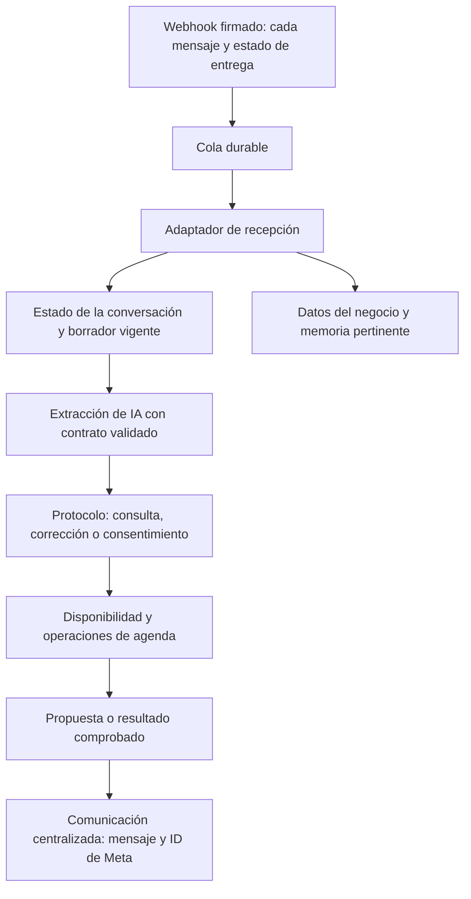

# Asistente virtual: mejoras implementadas y lo que falta

**Fecha:** 10 de octubre de 2026. **Estado actualizado:** `2.46.0` publicada y desplegada en el commit de implementación `1d55f3e`, CI aprobado. Ver [release y comprobaciones de la VPS](../history/RELEASE_2_46_0_ASSISTANT_20261010.md). **Base de la auditoría:** `2.45.2`, commit `ac6709b`. El paso 8 y la salida a beta externa siguen abiertos. Las secciones siguientes conservan también la evidencia inicial y señalan las validaciones reales pendientes.

**Continuación autorizada:** el responsable pidió completar la publicación y el despliegue después de este informe. Se añadió `scripts/assistant-agenda-postgres.test.cjs`, incorporado automáticamente al job existente `administration-postgres`. La prueba real detectó y permitió corregir la deserialización del resultado `void` del advisory lock de reprogramación; se convirtió a texto, como en la reserva existente. Las cinco comprobaciones más su contenedor pasan (6 tests, 0 fallos): reserva concurrente, destino ocupado, autorización, dos movimientos concurrentes y reserva compitiendo con movimiento. Los fixtures se eliminan por UUID y marcadores propios; no se envían mensajes ni eventos de Calendar.

La ejecución final del backend después de esta corrección pasó 180 suites / 1.420 tests en 30,874 s; lint terminó con exit 0. La limitación anterior sobre no haber ensayado el movimiento con PostgreSQL queda superada por esta evidencia local y CI, aunque sigue pendiente el recorrido simultáneo desde WhatsApp. El estado de publicación y comprobación de la VPS quedó registrado en el informe de release; las secciones siguientes conservan el alcance del informe inicial.

## 1. Respuesta a la pregunta del proyecto

Sí: las mejoras siguen criterios de un asistente de recepción confiable: entender el objetivo vigente, identificar correctamente a la persona y su mascota, usar datos reales del establecimiento, pedir consentimiento antes de actuar, conservar el estado y dejar evidencia de los resultados. La IA interpreta y redacta; las reglas de agenda autorizan y ejecutan las operaciones.

Ya se reorganizó el código y se implementaron las correcciones descritas abajo. No podemos afirmar que sea «uno de los mejores» a partir de pruebas automatizadas. Para demostrar calidad faltan conversaciones reales, medición de éxito y tiempo de respuesta, y estabilidad con usuarios simultáneos. Por ahora corresponde continuar el piloto interno supervisado.

El alcance sigue el [ADR 019](../decisions/019-asistente-contexto-y-operaciones-seguras.md), el modelo de dominio y las fases ya cerradas. No se añadió una plataforma de agentes, otra base de datos, un plan de Neon ni un servicio externo nuevo.

## 2. Qué cambió para el cliente

- **Cada reserva conserva su mascota y servicio.** Preguntar «¿para hoy ya no hay?» durante una reserva de peluquería mantiene ese objetivo; no cambia a listar la cita veterinaria de otra mascota.
- **La mascota se selecciona para la solicitud actual.** El historial no autoriza escoger una mascota ni inferir la especie de otra. Las correcciones invalidan la propuesta anterior.
- **Una negación o una pregunta no confirma.** «No confirmo», dudas sobre precio y cambios de mascota no guardan una cita.
- **La recogida requiere una dirección utilizable y revisión final.** «No sé todavía» no se acepta como dirección. La propuesta muestra mascota, servicio, fecha, hora, modalidad y dirección antes de guardar.
- **La confirmación guardada tiene saltos de línea y despedida.** Se diferencia de la propuesta todavía sin guardar.
- **Cancelar exige seleccionar y confirmar una cita concreta.** Si hay varias, se muestran con mascota y servicio. Se comprueba propietario y establecimiento; nunca se cancela automáticamente la última.
- **Reprogramar conserva la cita original hasta moverla.** Un destino ocupado o inválido no cancela la reserva anterior. Se conserva el mismo ID. Cambiar mascota o servicio durante esa operación exige iniciar otra reserva.
- **Peluquería respeta turnos consecutivos que aún se pueden reservar.** Un hueco anterior ya vencido no bloquea los siguientes; un hueco futuro reservable sigue siendo obligatorio. La consulta por un día utiliza ese día y explica las alternativas.
- **La información del negocio tiene fuentes concretas.** Horarios desde configuración, servicios desde el catálogo activo del establecimiento y precios sin inventar importes. La cotización automática completa queda pendiente; actualmente se pide verificación del equipo cuando corresponde.
- **El asistente se identifica como virtual.** La atención humana se solicita y registra, sin prometer que una persona ya está contestando.

## 3. Cómo quedó organizado



Se extrajeron componentes pequeños: `assistant-protocol`, `analysis-contract`, `conversation-management`, `assistant-business-info` y `whatsapp-delivery-receipt`. Se mantiene el adaptador existente de Recepcionista IA y la comunicación centralizada. `whatsapp.service.js` y `conversation.service.js` todavía coordinan parte del recorrido; no se declara una sustitución total del motor ni la eliminación de toda su deuda.

### Estado, memoria y coste

- Sesiones separadas por establecimiento y teléfono, con invalidación al cambiar de conversación.
- Escrituras de sesión ordenadas por conversación y esperadas antes de completar el procesamiento. Un fallo de persistencia invalida la copia de memoria que no pudo guardarse.
- Historial reciente limitado y caché con vencimiento/capacidad; se evita cargar todo el historial para cada mensaje.
- Extracción de IA restringida a campos y valores permitidos; no puede introducir IDs ni pasos arbitrarios.
- Una sola generación del vector de búsqueda para las dos fuentes. La búsqueda se usa cuando aporta información factual, y los saludos no se indexan indiscriminadamente.
- Umbral de similitud inicial `0.5`; el contenido recuperado se presenta como datos, separado de las instrucciones. El umbral todavía necesita evaluación con preguntas reales.
- Respuestas operativas deterministas y límites de tiempo en OpenAI, audio y transporte. Se registran tiempos y consumo de tokens donde el proveedor los devuelve. No se promete un porcentaje de ahorro ni una latencia que no se haya medido.

### Mensajes y fallos

- Un mensaje no soportado al inicio de un lote no oculta los mensajes válidos posteriores. Cada `wamid` tiene su propio trabajo durable.
- Si el último elemento de un lote ya estaba procesado, se conservan las respuestas válidas de los anteriores.
- El mensaje saliente conserva el ID devuelto por Meta en `Message.externalId`.
- Si Meta aceptó el envío y después falla la persistencia o la certificación, o si el transporte queda incierto, se detiene el reintento automático. El trabajo requiere revisión.
- Si una cita ya se guardó y falla después la actualización de sesión, el error se propaga para revisión; no se invita a repetir ciegamente la reserva.
- Los estados `sent`, `delivered`, `read` y `failed` recibidos por webhook se guardan de forma idempotente. Se usa `InboundJob` con `provider=whatsapp_delivery`, estado `done/complete`, como registro técnico, sin ejecutar el motor. Se relacionan por ID de mensaje; los conteos de conversaciones deben filtrar `provider=whatsapp`.

Estas medidas no equivalen a garantizar entrega exactamente una vez ante cualquier caída. Se conservan los checkpoints y la cuarentena existentes; los estados inciertos necesitan revisión del operador.

## 4. Qué se retiró

- Confirmaciones por coincidencias parciales y gestión implícita de la última cita.
- Simulador de desarrollo que anunciaba reservas sin persistirlas. `/test/analyze` queda como diagnóstico de extracción, sin crear citas; las pruebas del recorrido usan el adaptador real con dependencias externas simuladas.
- Helper de siguiente turno sin consumidores, campos sin productores y plantillas duplicadas.
- Doble vector para la misma búsqueda y redacción adicional de respuestas operativas ya completas.
- Captura clínica automática y análisis clínico de imágenes dentro de recepción: se retiraron `medical-auto-capture.service.js`, `medical-detection.service.js` e `image.service.js` y sus pruebas obsoletas. Las imágenes se registran y solicitan revisión humana; el payload durable conserva la referencia de origen.

No se eliminaron historias médicas, registros de clientes/mascotas, CRUD clínico ni integraciones de agenda. La visualización y el procedimiento completo de revisión de adjuntos por el equipo necesitan validación; este cambio no añade un visor al dashboard.

## 5. Seguimiento de los 24 hallazgos

«Implementado» significa cubierto localmente en el alcance descrito; no significa validado todavía en WhatsApp de producción. La [auditoría original](VIRTUAL_ASSISTANT_FULL_AUDIT_20261010.md) conserva la evidencia de la versión base.

| Hallazgo | Estado de esta entrega |
| --- | --- |
| AV01 — aceptación de negaciones | Implementado: protocolo común y regresiones de rechazo/duda/corrección. |
| AV02 — cancelación/reprogramación insegura | Implementado: selección autorizada, consentimiento y movimiento transaccional; falta ensayo concurrente con PostgreSQL real. |
| AV03 — disponibilidad confundida con citas existentes | Implementado: se conserva el borrador; regresión Matías/Akiles en el recorrido real del adaptador. |
| AV04 — corrección de mascota en peluquería | Implementado: invalida propuesta y datos asociados. |
| AV05 — dirección insuficiente | Implementado: validación y revisión final. No valida geográficamente la dirección. |
| AV06 — huecos vencidos bloquean peluquería | Implementado y reconciliado en el modelo de dominio; conserva secuencia futura. |
| AV07 — ignorar día solicitado | Implementado: consulta del día solicitado antes de ofrecer alternativas. |
| AV08 — listas sin mascota/especie inferida | Implementado: listas con mascota; especie de registro autorizado o pregunta explícita. |
| AV09 — escrituras de sesión sin esperar | Implementado: cola por conversación, snapshots y propagación de fallos. |
| AV10 — cachés solo por teléfono | Implementado: establecimiento, teléfono y conversación; falta evaluación de carga. |
| AV11 — escalamiento antiguo vuelve a activarse | Implementado: señal de escalamiento del turno y estado de control humano. |
| AV12 — JSON de IA sin contrato | Implementado: whitelist de campos, tipos y valores. |
| AV13 — fallo de análisis/saludo pierde el objetivo | Implementado: conservación del paso vigente. |
| AV14 — primer mensaje no soportado oculta hermanos | Implementado: normalización y encolado por mensaje. |
| AV15 — último duplicado descarta respuestas previas | Implementado: conservación de respuestas ya preparadas. |
| AV16 — envío aceptado seguido de fallo duplica | Contenido: conserva ID y detiene reintentos aceptados/inciertos; faltan recibos reales y simulación de caída completa. |
| AV17 — worker global serial bloquea otros chats | Pendiente de medición. No se añadieron workers concurrentes ni soporte de varias instancias. |
| AV18 — llamadas innecesarias | Reducidas; falta medir tokens/latencia reales y comparar con la base. |
| AV19 — recuperación sin umbral/datos como instrucciones | Implementado el filtro y separación; falta calibración y evaluación adversarial completa. |
| AV20 — historial y caché sin límites | Implementado: lectura acotada, vencimiento y capacidad. |
| AV21 — escritura clínica pasiva en mascota incorrecta | Retirada del recorrido de recepción; no se borra información histórica. |
| AV22 — imagen pierde continuación | Sustituida por registro y escalamiento humano; revisión de adjuntos de extremo a extremo pendiente. |
| AV23 — identidad humana falsa/información inventada | Corregido el prompt y las fuentes de catálogo/horarios; falta evaluar preguntas reales y cotización. |
| AV24 — simulador duplicado/helpers muertos | Retirados o sustituidos; grep de consumidores ejecutado sobre el repositorio. |

## 6. Evidencia final de verificación

Backend ejecutado con **Node `v24.15.0`**, desde `backend/`:

```text
node node_modules/jest/bin/jest.js --runInBand
exit=0 signal=null
Test Suites: 180 passed, 180 total
Tests:       1420 passed, 1420 total
Time:        27.933 s
```

Lint desde `frontend/`:

```text
npm run lint
> frontend@0.1.0 lint
> eslint
exit_code=0
```

Comprobaciones adicionales:

```text
node --check: 50 archivos JavaScript modificados/nuevos, 0 fallos
git diff --check: exit 0
Consumidores ejecutables de los módulos/helpers retirados: ninguno
backend/package.json y backend/package-lock.json: 2.46.0
```

El grep abarcó código del repositorio, excluyendo dependencias, archivos generados y respaldos; las referencias históricas de documentación se conservaron. No hubo cambios de schema ni migraciones. El primer intento del runner usó accidentalmente Bun y falló por incompatibilidad del runtime; la ejecución final completa anterior utilizó Node y pasó.

Las pruebas automatizadas de conversación usan el motor/adaptador real, con OpenAI, Meta y persistencia externa simulados. No certifican comprensión del modelo real, envío/entrega real ni concurrencia de reservas en PostgreSQL. No se ejecutó `test:postgres` en esta entrega: `INBOUND_TEST_DATABASE_URL` no estaba configurada y esa suite existente cubre la cola, no el nuevo movimiento de citas. No se utilizó la base del usuario para suplirlo.

## 7. Qué falta y en qué orden seguir

1. **Publicar la candidata de forma controlada:** revisar diff, crear commit y push, comprobar CI, desplegar y verificar versión, salud, worker y rollback. Esta entrega todavía está local; no atribuirle resultados de la VPS.
2. **Completar el paso 8 con el número de prueba de Meta:** Matías/Akiles, selección de otra mascota, negativos, cambio de datos después de propuesta, recogida con dirección, cancelación ambigua y reprogramación fallida. Ver la [matriz](CLOSED_BETA_AGENDA_MATRIX_20260926.md).
3. **Probar competencia por el mismo turno con PostgreSQL real:** dos clientes distintos, una sola reserva válida, rechazo claro al segundo; reprogramación a destino ocupado conserva fecha/ID original. Comprobar dashboard y BD, además del texto recibido.
4. **Verificar transporte y atención humana:** unir el ID saliente con `delivered/read/failed`, separar esos registros de trabajos entrantes y ensayar el procedimiento de `needs_review`. Confirmar liberación del control humano y revisión real de adjuntos.
5. **Medir un lote representativo de conversaciones:** éxito por escenario, turnos innecesarios, confusión persona/mascota/servicio, mensajes perdidos o duplicados, tiempo de respuesta P50/P95, espera de cola y tokens. Si un chat lento perjudica a otros, diseñar concurrencia acotada por conversación sobre la infraestructura existente antes de ampliar el piloto.
6. **Reiniciar la ventana de estabilización para la versión desplegada:** 48 horas, observar capacidad de PostgreSQL en la VPS, entregas, cola, fallos y continuidad del respaldo. Después completar documentación/acuerdo del piloto y decidir la cohorte inicial.

**Criterio de calidad:** cero operaciones destructivas o reservas sin consentimiento en la matriz; cero mezcla de cliente, mascota o establecimiento; ninguna pérdida de la cita original en los fallos ensayados; evidencia de cada resultado en agenda y transporte. Registrar fallos del modelo real como regresiones antes de ampliar usuarios. Los umbrales de latencia y consumo se fijan con las mediciones del piloto, no con cifras inventadas.

**Decisión actual:** apto para revisar y publicar como candidata a nuevas pruebas internas; aún no se certifica beta externa. Se conserva PostgreSQL/Docker en la VPS y el número de prueba de Meta conforme a las decisiones del proyecto.
